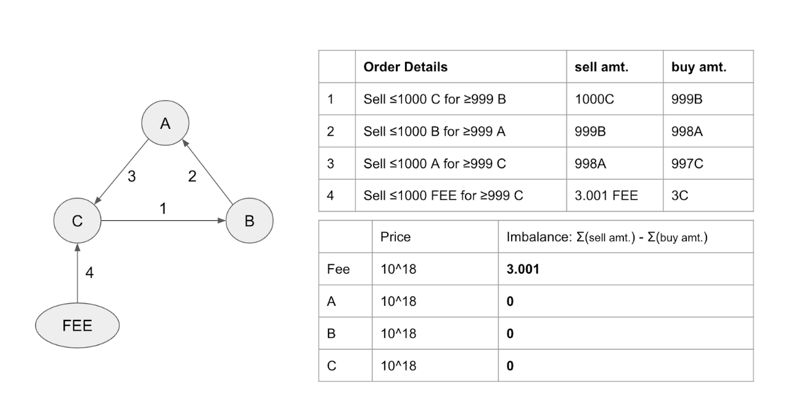
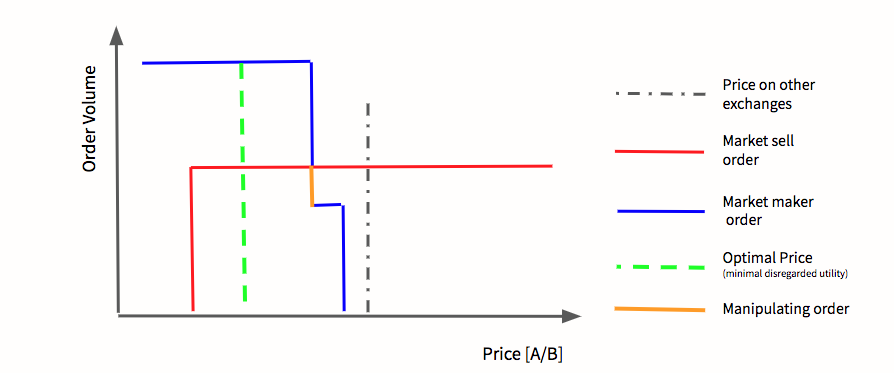

The main smart contracts for Gnosis Protocol are the *EpochTokenLocker* and *BatchExchange*. 

As mentioned before, trading happens in batches. While a batch is being solved it is important that information about this batch (such as the account balances and orders) is immutable. Finding the optimal settlement is a computationally expensive process and changes in, e.g. available balance, would influence the optimal solution. Note, however, that the smart contract does accept balance and order updates for the next batch. Therefore, balance updates and order adjustments need to be managed in a particular manner. 

*EpochTokenLocker* is the smart contract dealing with these “staged” deposit and withdrawal of funds.

*BatchExchange* contains all exchange related logic (placement and adjustment of orders, submission, and verification of solutions).

## Epoch Token Locker
The *EpochTokenLocker* has the task to manage all deposits, balance updates and withdraws for the exchange. It serves as the foundation for any interval-based system that requires user deposits and withdraws.

Batches (Epochs) run back-to-back (without interruption) and are indexed with a batchId. The *batchId* is derived from the beginning of unix time (*batchId* 0 started 1.1.1970 00:00) and is incremented continuously every 5 minutes (thus <span style="color:#DB3A3D">`currentBatchId == getCurrentTime() % 5 minutes`</span>).
### Actors
- Traders: All deposits and withdrawals are made exclusively through the interface of the *EpochTokenLocker*.
- Solver: The trading system needs an external player providing the solution - the best prices - for a batch. These solvers are granted a reward for their contribution which can be redeemed through the withdrawal interface of the *EpochTokenLocker*. 

### Features
Due to the interval-based trading logic, the *EpochTokenLocker* needs to support the following high-level interactions:

1. Read and, tentatively, write balances which are valid for the batch that is currently being settled (only called by settlement logic). A better solution for the same batch might revert and re-update previous balance updates
2. Read and write balances that are valid for the next batch (used by external actors)

Due to these high-level requirements, *EpochTokenLocker*stores the users’ balances in a mapping where the value is a struct with three fields:

1. **balance** as of the batch that is currently being solved
2. **pendingDeposits** including the amount and batchId as of which the deposit can be traded
3. **pendingWithdraws** including the amount and batchId as of which the withdrawal can be transferred out of the exchange.

In order to compute the available balance at a given <span style="color:#DB3A3D">`batchId`</span> we apply the following logic:

```
balance  = balances[user][token].balance
if (pendingDeposit.stateIndex < batchId) {
  balance += pendingDeposit.amount
}
if (pendingWithdraw.stateIndex < batchId) {
  balance -= pendingWithdraw.amount
}
```
**Deposits**

A user initiates a deposit by calling the <span style="color:#DB3A3D">`deposit`</span> function of the *EpochTokenLocker*. Before creating a new deposit, a potentially matured previous deposit is added to the balance.
We then create a new <span style="color:#DB3A3D">`pendingDeposit`</span> for this user (if an immature previous one exists the amounts are added). 
Now one can access both the balance for the upcoming batch via <span style="color:#DB3A3D">`balance + pendingDeposit.amount`</span> as well as the balance for the batch that is currently solved via just <span style="color:#DB3A3D">`balance`</span>.
The next time the user's account is mutated, <span style="color:#DB3A3D">`updateDepositBalance`</span> will check and add the <span style="color:#DB3A3D">`pendingDeposit`</span> to the balance if it matured.

**Withdraws**

A withdraw is initiated by a user by calling <span style="color:#DB3A3D">`withdrawRequest`</span>. It does nott affect the balance of the user in the previous batch, it only creates a withdraw **request**.

The withdrawal process can be finalized by calling <span style="color:#DB3A3D">`withdraw`</span> in any future batch. Finalizing a withdraw transfers the requested funds from the *EpochTokenLocker* into the user's wallet. Matured but not yet executed requests are deducted from the balance whenever <span style="color:#DB3A3D">`getBalance`</span> is called as they could be withdrawn at any time. Thus they should not be available in the batch that is currently being solved.

If a matured withdraw request already exists it will be automatically claimed on behalf of the user before creating a new withdraw request. This is to avoid the following scenario: A user with a matured but unclaimed request is considered by benign solvers with a balance equal to <span style="color:#DB3A3D">`balance - pendingWithdraw.amount`</span>. If they now override the pendingWithdraw, they would also update the <span style="color:#DB3A3D">`pendingWithdraw.stateIndex`</span> field and thus the balance calculation would change (it would now be all of <span style="color:#DB3A3D">`balance`</span> since the condition for subtraction <span style="color:#DB3A3D">`pendingWithdraw.stateIndex < batchIndex`</span> would no longer be true). 
A malicious solver might have started their computation knowing that the users balance will be higher and thus would have an advantage over benign solvers that were assuming less balance.

**Balance Updates**

There are two kinds of processes to update balances: <span style="color:#DB3A3D">`addBalance`</span> and <span style="color:#DB3A3D">`subtractBalance`</span> are the only methods to directly modify the user’s balance. These methods are used to make final changes to the balances of a user, i.e. for crediting the<span style="color:#DB3A3D">`pendingDeposit`</span> to the balances or accounting a claimed withdrawal request. 

<span style="color:#DB3A3D">`addBalanceAndBlockWithdrawForThisBatch`</span> is the second function for updating the balances. It has the same functionality and it internally calls <span style="color:#DB3A3D">`addBalance`</span>. However, additionally, this function call ensures that any valid withdrawRequest can not be withdrawn for the modified balance. This is enforced by setting the variable ‘lastCreditBatchId’ to the current <span style="color:#DB3A3D">`intervalBatchId`</span>  and does not allow anyone to withdraw any balances if the <span style="color:#DB3A3D">`lastCreditBatchId`</span> is less than or equal to the currentBatchId.

 <span style="color:#e8663d">*Such  withdraw blocking is necessary to prevent the following attack:*</span>

A settlement could credit funds to a user with a valid withdrawRequest to withdraw these funds. Since the user has this valid withdrawRequest, they could immediately withdraw those funds before a better solution was submitted. Now, if a better solution is submitted, which would no longer credit the funds to this specific user, the smart contract could not accept this better solution, as the withdrawal could not be undone.

## Exchange Engine

The *BatchExchange* allows users to manage their orders (placing and cancellations). It enforces the market mechanism by verifying and optimistically applying the current-best settlement information for each batch-auction.

### Actors

- **Traders:** placing and canceling orders
- **Solver:** providing the settlement information (clearing prices and executed buy amounts). Multiple providers are competing against each other. The *BatchExchange*rewards the best solution.
- **Token-lister:** anyone can list tokens on the exchange on a smart contract level for a fee.

### Token Listing

Before a token can be traded on the exchange it has to be listed. Listing is a permissionless process and can be done by anyone. 
In order to prevent spam-listing, we require to burn 10 ‘feeToken’. The <span style="color:#DB3A3D">`feeToken`</span> will be OWL (utility token derived from GNO).

In order to reduce the amount of data needed to represent an order on-chain, tokens are referred to by a tokenId (uint16) rather than their address. The *tokenId* acts as a foreign key into the bijective mapping between the token addresses and their identifiers, which is managed by the library <span style="color:#DB3A3D">`IdToAddressBiMap`</span>.


### Order Management

Any ethereum address can place arbitrary limit sell-orders for themselves. An order has the following semantics:

 <span style="color:#e8663d">**Sell x of sellToken for at least y of buyToken**</span>

The order also specifies a time interval consisting of a start and an end batch index for which it is valid. This allows placing short or long-lived orders and even orders that only become valid in the future.

Orders can be fulfilled partially. That is we can fulfill a buy amount <span style="color:#DB3A3D">`x’ < x`</span> as long as the resulting buy amount <span style="color:#DB3A3D">`y’`</span> satisfies the limit price as indicated by the ratio of <span style="color:#DB3A3D">`x/y`</span>. In case of partial fulfillment the variable <span style="color:#DB3A3D">`usedAmount`</span> of the order is increased by the partial volume <span style="color:#DB3A3D">`x’`</span>. The new sell volume of the order is then given as  <span style="color:#DB3A3D">`x - usedAmount `</span> while the limit ratio for the remaining fulfillment remains the same <span style="color:#DB3A3D">`x/y`</span>.

Orders, at the time of placement, do not need to be “covered”. This means the sell amount <span style="color:#DB3A3D">`x`</span> can be much higher than the available funds. A settlement, however, would only be able to execute amounts that lead to non-negative account balances at the end of each batch.
However, one could be receiving <span style="color:#DB3A3D">`t_sell`</span> from another order within the same batch and reuse the proceeds immediately. It is only important that at the end of a settlement all balances are non-negative.

Traders can cancel orders at any time. However, the orders stay valid for the batch that is currently being solved (as solvers might have started a long-running computation under the assumption that this order is available). It will only be invalidated for the batch that will be solved next. 
Once the solution submission period for the current batch is over, the order can also be purged from storage resulting in a small gas refund (<span style="color:#DB3A3D">`freeStorageOfOrders()`</span>).

### Fee Mechanism
Traders pay a 0.1% fee on the executed trade-amount. When computing the allocation resulting from a trade, the fee is added to the uniform clearing price. The uniform clearing price itself is arbitrage free and thus cannot contain any fee information (<span style="color:#DB3A3D">`price(tokenA, tokenB) == price(tokenB, tokenA)`</span> by definition).
The resulting allocation of a trade after fees is thus calculated by:

```
exec_buy_amount = exec_sell_amount * price(sellToken, buyToken) / 1.001
```

Note, that the limit price specified in an order includes the fee. This means that a trade will only occur if “after fees” the exchange rate is better than the limit price. Therefore an order offering to trade two tokens at 1:1 might not be matched, even if the price vector indicates a 1:1 exchange rate (since after fees the exchange rate won’t satisfy the limit price).

Fees are collected in Gnosis’ OWL token (a derivative of the GNO token - for more information cf. the whitepaper).
OWL serves as the reference token of the exchange (tokenId 0) with a fixed price of 10^18. As fees are deducted from each trade, they intuitively create a surplus in each trade’s sell token balance (more tokens are sold than their equivalent bought). That surplus, however, can be shifted in a way that the only imbalance in the sum of tokens bought and sold ends up in a single token (cf. solution submission - validity for more information on the balance criteria).  The example below exemplifies a ring trade between stable coins where the only surplus results in the OWL token.



A trader therefore doesn’t have to own any fee token in order to trade. Merely, there has to exist some sell order connecting OWL to each connected subgraphs in the batch.

Half of the surplus is burned in order to deflate the supply of OWL. The other half is awarded to the best solution submitter.

### Solution Submission

Once the order collection time of a batch is over, the auction closes (all containing orders/balances become immutable) and competing solvers start searching for the best valid solution. We first define solution validity followed by a notion of objective valuation so to describe what makes one “better” than another.

**Solution Validity**

Each solution exist of the following attributes
1. A vector with a single clearing price for each token that was exchanged in the batch. Note, that this format ensures arbitrage freeness within a settlement (<span style="color:#DB3A3D">`p(t_1,t_2) * p(t_2, t_3) == p(t_1, t_3)`</span>).
2. The executed buy amounts of the orders in the batch. 
3. For technical reasons, a solution also contains pointers to the subset of orders that are relevant for the settlement.

Given the executed buy amounts and price vector, the executed sell amounts for each trade are uniquely determined.

A valid solution must satisfy the following constraints:

1. **Limit amount & price satisfaction:** If an order has a positive buy amount, the resulting sell amount must be less or equal than the remaining sell amount on the order (no over-fulfillment). Moreover, the clearing price between the buy and sell token must be greater than or equal to the specified price in the order. That is:

 <span style="color:#DB3A3D">`execution.sellAmount / execution.buyAmount <= order.maxSellAmount /  order.minBuyAmount`</span>.

2. **Token conservation:** For all tokens, except the fee token (tokenId 0), the amount of tokens bought in the settlement must equal the amount of tokens sold. For the feeToken, the requirement is that more feeTokens were sold than bought (generating a surplus  which is awarded to the solver).
This constraint ensures that, at all times, the amount of tokens owned by the smart contract correspond exactly to the user’s balance. This also holds for the feeToken as well, since the positive difference between the tokens sold and the tokens bought, will be split with one half going to the solution submitter and the other half gets “burned”.

3. **Price vector normalization:** The price of the feeToken has to be 10^18. Otherwise, the objective value (cf. next section) could be scaled arbitrarily.

4. **Size restriction:** Each batch can settle at most 25 orders. This number is arbitrary but ensures that the gas needed for the settlement transaction fits well into one ethereum block (~40%). This creates an even playing field between solvers as otherwise active miners might be able to submit transactions that are close to the block gas limit and thus create “better” solution than other participants.

5. **Minimal trade amount & price:** All prices and trade amounts need to be larger than 10^4. This guarantees that any benefit from rounding errors are smaller than the fees paid for an order, rendering such attacks uneconomic (cf. remark below).


 <span style="color:#e8663d">*Remark (Maximal rounding error):*</span>

*Since solidity works with uint256, the calculation of the sell amounts from the prices and buy amounts might create rounding errors. From the following formula, we see that the rounding error is at most 1, as feeDenominator < sellTokenPrice.*


```
function getExecutedSellAmount(
       uint128 executedBuyAmount,
       uint128 buyTokenPrice,
       uint128 sellTokenPrice
   ) internal view returns (uint128) {
       return uint256(executedBuyAmount).mul(buyTokenPrice).div(feeDenominator - 1)
           .mul(feeDenominator).div(sellTokenPrice).toUint128();
   }
```

*Due to the fact that minimal trading amounts are required, this rounding error is percentage-wise less than 0.1% and hence less than the charged fee.*

**Solution Valuation**

The *BatchExchange* compares different submissions for the same auctions with regards to an objective function, replacing the best solution to date if a better one is submitted. A solution must be at least 1% better than the currently best one in order to be replaced. Solutions have to be submitted within four minutes after the auction has closed.


The objective value is calculated using the following metrics:

1.**Traders’ utility:** Sum of utilities of all trades. The utility of a trade is the amount of tokens the trader received more than the limit price they specified (trade.buyAmount - prorated order.buyAmount), weighted by the price of the buy token:
```
U = (execBuy - (execSellTimesBuy / order.priceDenominator)) * currentPrices[order.buyToken]
```

2. **Disregarded Utility:** Sum of disregarded utilities of all (executed) trades in the solution (i.e. untouched orders are ignored). The disregarded utility of a trade is defined as the difference between maximal and actual utility (as defined in 1.). The maximal utility is the utility if the trade had been fully executed at the computed prices (trade.buyAmout == order.buyAmount). The maximum possible buy amount can be further restricted by the available balance of the trader (see remark below).
3. **Collected Fees:** Defined as the fee token imbalance of the settlement (token conservation is strictly positive for fee token). With rounding errors, this roughly equals the sum of fees charged for all trades and thus is a derivative of traded volume.

The combined objective function for a settlement is defined as:

 *Objective value :=* Traders’ Utility - Disregarded Utility + Collected Fees / 2

 <span style="color:#e8663d">*Remark (Disregarded utility):*</span>

*The maximal possible utility is bounded by the available sell token balance of the trader. Since this balance might change throughout the settlement (e.g. they might receive more balance in the last trade), the disregarded utility is calculated after the settlement. 
While this helps to determine the available (“unused”) sell token balance of an order, this unused balance can contribute to the disregarded utility of many orders if all of them have the same sell token. In reality however, the balance might only be sufficient to settle a subset of these orders. Thus disregarded utility might be overestimated by the smart contract. We are not aware of a way to compute the exact disregarded utility efficiently from within a smart contract.*


**Rationale for the objective function:**

Traders’ utility captures the overall benefit for all traders to participate in the auction for a given price and fulfillment. Therefore it could intuitively suffice to optimize for this metric.
However this might adversely affect “**market orders**”:

While the only order type supported at the moment is a limit sell order, market orders can be simulated by specifying very low limit price far away from the current market rate. Smart contracts which are not aware of external price information might use these types of orders e.g. for liquidation of margin trading accounts. In the extreme case there might be two opposite “market orders”. Any price within the large range of their limits would be valid and the sum of utilities would be equal across the price range.

In order to find “fair” prices in the case of overlapping order-books (e.g. two inverse market orders), we examine the amount of volume available at a given price point.
Let’s take the example of two stablecoins USD-A and USD-B, which both consistently trade at 1$ on other exchanges. There could be several liquidity providers selling large volumes of USD-A at a slight premium (with limitPrice(A->B) = $1.01). If a “market order” (with limitPrice(A->B) = $0.90) was to buy USD-A any price between $0.90 and $1.01 would create roughly the same cumulative utility (~$0.11 on the unit). However intuitively, since there is a lot of volume offered at $1.01 the trade should (according to our protocol) be settled near that price.

Disregarded utility captures this intuition. If we chose a price close to $0.90, a lot of liquidity providers would be “happy” to make the trade, but only a few (up to the size of the “market order”) would be able to participate. The unfulfilled portion would contribute to disregarded utility (max. possible utility - achieved utility).
If however, we chose a price at $1.01 the market makers are indifferent about trading. Thus, their disregarded utility is 0. Since the “market order” is completely filled it doesn’t accrue any disregarded utility.
In a valid price range, the clearing price will therefore move towards the end of more liquidity.

Due to resource limitations of the EVM, the disregarded utility calculated by the smart contract considers only orders contained in the settlement (ignoring untouched orders). This still forces the price to be on the end of the “larger” order, but enables a potential attack when crafting carefully sized counter-orders (cf. Known Issues - Market order exploit section).

Indifferent trades (two inverse trades with exactly matching limit prices) generate neither utility nor disregarded utility. Therefore, half of the accrued fees are added to the metric. By adding this derivative of traded volume to the metric the “indifference-tie” is broken in favor of making the trade.

Note, that if we awarded the full fee amount (or a larger derivative) to the objective function, we would incentivize bloated settlements with unnecessarily long ring trades. Each “hop” in the ring would generate more volume derivative than it cost fees to the trader (an unnecessarily long ring produces less utility than a shorter ring). This would make the “volume part” of the equation grow faster than the “utility part” would shrink.

Remark: Each solution submitter is incentivized to maximize their solution submission reward minus the gas costs of their transaction. As a small order might result in a small fee, it might not justify the gas costs associated with executing it.

**Replacing a less optimal solution**

As described in the previous section, the *BatchExchange* compares different submissions for the same auctions with regards to the objective function. The first solution provided to the smart contract gets accepted, if it is valid and has a positive objective value. Any further solution must be at least 1% better than the currently best one in order to replace it. 
The restriction in the batch-size ensures that all operations: reverting an old solution and submitting a better solution take only a fraction (40%) of the ethereum block gas limit. 


 <span style="color:#e8663d">*Remark:*</span>

`submitSolution` takes the claimed objective value as a parameter. This allows the smart contract to quickly check if the proposed solution is sufficiently better than the existing one (e.g. when multiple good solutions are submitted in the same ethereum block). This saves gas, as otherwise, the whole calculation for the objective value would have to be paid for before reverting.

## Known issues

There are a few known problems with the current design, which are explained in this section.

### Solution submission is front-runnable

Each solution submitter has the risk that their transaction might be front-run. Their transactions including all necessary solution data will be visible in the memory pool of the Ethereum network and could be resubmitted by anyone with a higher gas price. We don’t protect against this (e.g. by using a two phase commit-reveal submission) and believe this is acceptable for the MVP.


### Market order exploit
A special market maker could exploit market orders by using the limitations of the disregarded volume calculations. Here is an example:
Imagine we have two market maker orders selling token A a little bit below the observed market price on other exchanges. Also, there is one market order, selling token B much below the observed market price. Now, it would be expected from a fair trading mechanism that the price of the auction would be close to the market makers’ orders and that the market order is not exploited. This is shown in the following graphic. The optimization function “disregarded utility on matched orders”, would find this solution, as this price is the only solution generating a  maximal trading utility and can be achieved with a disregarded utility of 0.


However, a clever market maker could insert, at the last second, another order into the batch, such that their order and the first market maker order match up exactly the volume of the market sell order with the limit price of the market order.

If they then submit the solution that trades their order and the first market maker against the market order, then - because the volumes match - the disregarded utility of matched orders is zero, no matter where the price is set. If the value of the token B is higher than the price of token A, then the maximal utility measured in the buyTokens is extracted with the solution of the attacker with the unfair price.

This is a high priority issue and will be immediately addressed in the future versions of the contract.



### Withdraw delaying attack
Withdraws that were requested in a previous batch and are thus valid in the current batch can be postponed by a malicious actor assuming the person wishing to withdraw has a matchable order in the auction. An attacker can credit a small buy amount to that order. This would increase the tokens balance and thus postpone the withdrawal to the next batch. The withdrawal would remain postponed, even if the solution was later overridden by a better solution not touching that balance. To remedy this, the trader would have to also cancel all pending orders that could lead to an increase to their balance.

### Fake-token utility
Utility is weighted by the prices of the buy token, which are intrinsic to our exchange and not related to market prices from other exchanges. Thus fake-tokens can be used to generate “fake” utility. 
This fake-token utility and the market order exploit are of immediate concern for future versions.


