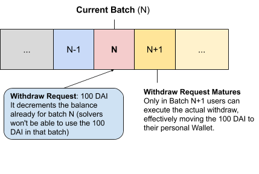

## What is a Batch and a Batch ID?

On Gnosis Protocol, orders  placed on-chain are not immediately executed, but rather **collected and aggregated to be settled in batches. These batch order settlements occur every 5 minutes consecutively.** This will give you an overview of how batches play a critical role in Gnosis Protocol operations.

Every batch is identified by a **batch ID**. This identifier tells us the exact start and end time during which a batch was "active".


On Gnosis Protocol, a central operator is replaced by an open competition for order matching, and the term **solver** refers to anyone who submits an order settlement solution for a batch.  As soon as a batch is "closed for orders" meaning that it does not consider any new orders, these solvers can compete to provide optimized solutions for the next four minutes, matching the orders in this closed batch.

**Note**: While out of scope of this explainer on batches, to learn more about solvers visit [this section](https://docs.gnosis.io/protocol/docs/introduction1/#solvers) in the Gnosis Protocol documentation.

## 🌘 Phases of a batch

Every batch on Gnosis Protocol has a series of phases. Depending on its phase, a batch will accept either orders, solutions, or neither.


In summary, a batch has three phases:

1.  **Collecting orders**: A batch is in the *collecting orders* phase as long as it is the current or future batch. Any user may place an order that qualifies for a batch in this phase. Orders have an expiration batch, so they can be eligible for multiple future batches. This phase is referenced as batch N or N+ in the diagram below.\


2.  **Accepting solutions**: After collecting orders, a batch closes for orders, meaning that it no longer considers new orders for inclusion in order settlement, and enters the *accepting solutions* phase represented as batch N-1 in the diagram above. During this phase, solvers have 4 minutes to submit order settlement solutions. After the first solution is submitted, to submit a new solution, it must significantly improve (more than 1%) the [objective function](https://docs.gnosis.io/protocol/docs/devguide03/#solution-submission) as defined by the protocol in comparison to the previously submitted solution. At the end of the 4 minutes, the best submitted solution will determine the trades that are executed in that batch.

    While we consider Batch N the Current Batch, solutions are accepted for Batch N-1:


3.  **Finalized/ Settled**: After the 4 minute accepting solutions phase, a batch then enters the *finalized/ settled* phase in which it no longer accepts order settlement solutions (or new orders), which is shown in the diagram below. Batches including N-2 and older are also always in this finalized/ settled phase. A finalized/ settled batch with a valid order settlement solution will include executed trades.


## ⏱ How can I get the Active time from a given batch ID?

From a given batch ID, we can find when it was or it will be "active" as the "Current Batch."

Batch IDs are based on [Unix Epocs](https://en.wikipedia.org/wiki/Epoch_(computing)). This means batch IDs can be easily converted to Unix timestamps by multiplying the batch ID by its duration in seconds.

Let's start with an example for the batch 5,312,588. Since all batches run for 5 minutes (300 seconds), we can always convert a batch into an [Epoch](https://en.wikipedia.org/wiki/Epoch) by using the product of its ID and duration:

```
Batch ID * 300 seconds = Time in Epoch format
5,312,588 * 300 = *1,593,776,400*
```

If we input this epoch on [epochconverter.com](https://www.epochconverter.com/), we can easily retrieve the human readable time format of the batch:


This means that batch 5,312,588 was active during the timeframe:

-   **From**: Friday, 3 July 2020 11:40 GMT

-   **Until**: Friday, 3 July 2020 11:45 GMT

Note that Epochconverter can provide the time in both your local timezone and in GMT.

## 🆔 How can I get the batch ID for a given time?

If we want to find the batch ID number for a given date and time, we can easily calculate this because batch IDs are based on Unix timestamps.

To get the batch ID, we can input the desired date and time on [epochconverter.com](https://www.epochconverter.com/). Make sure you select GMT or your local timezone, depending on the time for which you are searching.


The example search above returns the time as an [epoch](https://en.wikipedia.org/wiki/Epoch), which is 1593776400 in this case. To retrieve the batch ID, we should divide the epoch time (Unix timestamp) by 300, which is the duration of a batch in seconds:

```
Epoch time format / 300 seconds = Batch ID
1593776400 / 300 = 5,312,588
```

This returns 5,312,588 as the batch ID, which is the same batch referenced in the previous section on converting from batch ID to human readable time.

## 📏 How accurate are batch IDs for determining their date and time?

The Gnosis Protocol smart contract uses the Ethereum block time to determine the current batch ID.

Note that this timestamp can be influenced by miners to some degree, and therefore can slightly differ from the actual time. However, the current block timestamp must be strictly larger than the timestamp of the previous block, and miners tend to not mine blocks with a timestamp too far in the future [[1]](https://ethereum.stackexchange.com/a/428), so the discrepancy will be relatively small, i.e. on the order of seconds.

## 🐛 When does an order become tradable?


New orders are only tradable---that is, considered for order settlement--- **after** the batch that is current when the order was placed, is closed. This is because solvers only work on order settlement solutions for closed batches. This means that when you place an order to be part of a batch, it can only be considered for the next open batch, e.g. batch N+1.

## 👀  How does the protocol use batch IDs?

### Orders

Gnosis Protocol uses batch IDs to determine the validity of orders.

When placing an order, the order's validity is expressed in terms of the batch ID in which the user would like the order to become tradable and the batch ID by which the order expires.

For example, an order valid from batch ID 35 to 46 can be traded in solutions for batch 35 until and including batch 46.

This means that Gnosis Protocol **allows you to also create orders that can only be executed in the future, and expire automatically after a defined number of batches**.


### Trades

Gnosis Protocol settles trades in batches, and therefore all trades settled in the same batch have the same batch ID.


### Deposits

Gnosis Protocol automatically and implicitly assigns all deposits a batch ID if one isn't specified. The batch ID of a deposit is the current batch ID, the deposit is only tradeable in the following batch, analogously to when orders are submitted to the current batch, as explained in *When does an order become tradeable?*


### Withdraw Requests

Gnosis Protocol allows users to optionally specify a batch ID when requesting a withdrawal. When the batch ID is omitted, the withdrawal request defaults to the current batch ID, meaning the withdrawal can happen as soon as the following batch.



When the current batch ID is greater than one specified in a withdrawal request, we say the request **has matured**. Before a withdrawal request has matured, the user balance considered by solvers doesn't take the withdrawal request into account. This allows you to schedule a withdrawal effective only in the future. 

When a withdrawal request has matured, the withdrawal amount requested is deducted from the effective user balance, which means the user can then perform the actual withdrawal.

### Withdrawal

Gnosis Protocol automatically assigns withdrawals the batch ID during which the funds were actually withdrawn, 


This withdrawal operation executes a pending withdrawal request that has matured, effectively sending the tokens from the Gnosis Protocol smart contract to the user's wallet.

Wrapping Up
-----------

Batches and batch IDs are an important part of Gnosis Protocol. All the operations on the protocol make use of batch IDs to define and enforce the protocol's ruleset, so that users and solvers collaborate in a decentralized way.

In this overview, we saw how you can use deterministic batch IDs to retrieve batch times and place future orders. These unique properties of Gnosis Protocol allow users to essentially create **programmable orders** with complex and conditional executability.

Learn more about Gnosis Protocol [here](https://docs.gnosis.io/protocol/docs/introduction1/).

