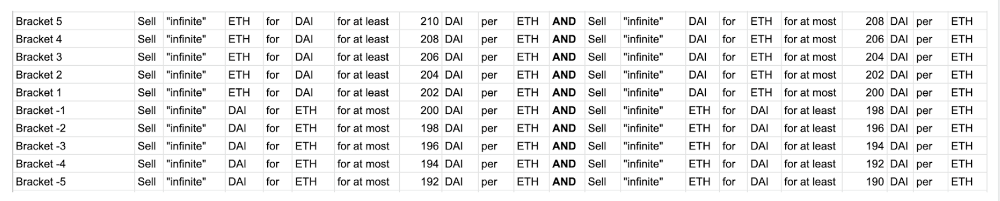
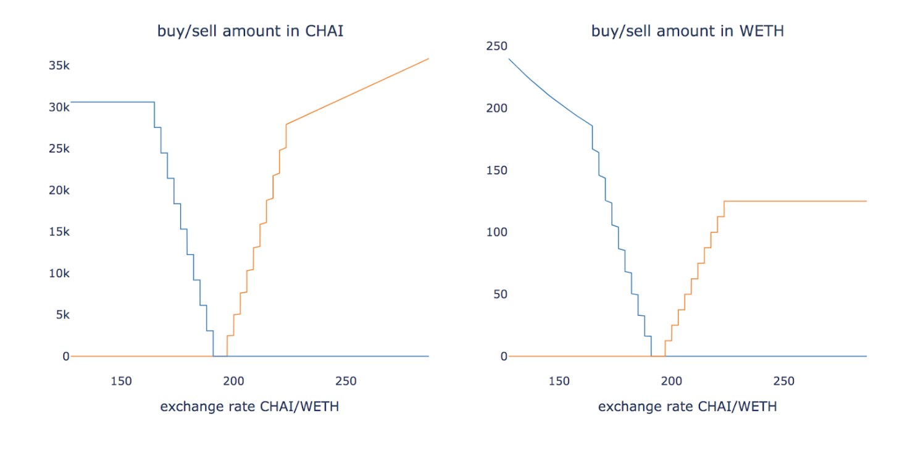
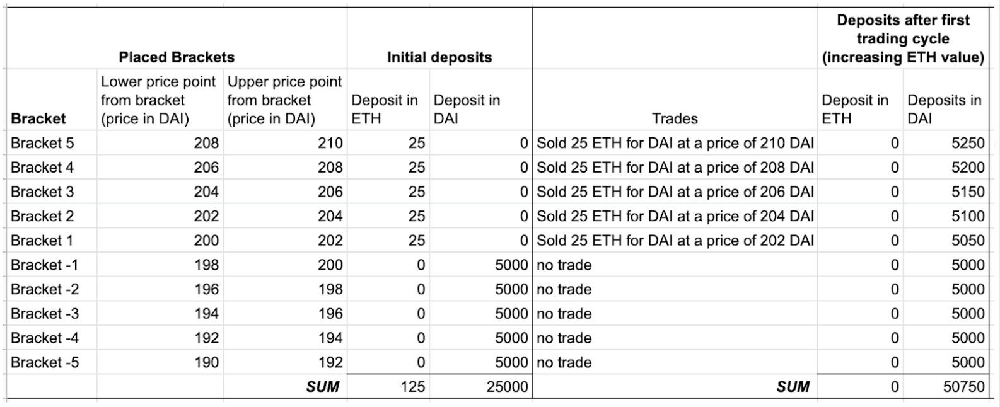

_**Disclaimer**: This summary is for informational purposes only. It is not a risk assessment, nor investment advice! It is not intended to substitute for the advice of licensed professionals. Gnosis believes that the information is accurate as of the date of publication. No warranty of accuracy is given, and no liability for any error or omission is accepted by Gnosis Ltd. and/or its affiliates._

## Summary of CMM advantages
*  Usable for any ERC-20 token pair
*  No maintenance required
*  Efficient use of inventory (locked capital)
*  Can be set up any time: it does not depend on current market price, but instead future price ranges you define
*  Can be cancelled at any time 
*  Highly flexible tailored price ranges
*  Useful for volatile tokens
*  No gas costs are incurred for after the CMM is set

## Overview

### What is the custom market maker on Gnosis Protocol?
The custom market maker (CMM) allows you to set multiple limit orders at custom price brackets and passively provide liquidity on Gnosis Protocol.

In summary, the CMM works by placing multiple limit orders between a token pair. These limit orders occur at different price ranges referred to as brackets. When token price moves through the price points specified by the brackets, the CMM automatically provides liquidity to the countertrade. 

If you are familiar with pooling on Uniswap, it is a similar style of liquidity provision through automated market making. However, the main difference is that with the CMM capital is used in a much narrower, defined range, whereas in Uniswap a portion of your capital is reserved for either token at a price of zero. Another difference is that you can set up the custom market maker at any time, independent of current market prices, not only when you believe the current price reflects the correct market price. The CMM can be used for any token pair listed on Gnosis Protocol, rather than only ETH/another token. (Note: to learn more about how the permissionless token listing works read [this tutorial](https://docs.gnosis.io/protocol/docs/addtoken1/).

### How does the custom market maker relate specifically to Gnosis Protocol? 
It directly takes advantage of unique design properties of Gnosis Protocol:
Standing orders are valid until cancelled
Standing orders can be set up for an unlimited sell amount
Each order remains valid, even if the balance held on Gnosis Protocol is zero
Orders that have a corresponding deposit balance can be matched, but only up to the available amount

## How to use the CMM

### How do I set up the custom market maker on Gnosis Protocol?
Today, to set up the custom market maker, we provide you with a script. Please continue reading below and refer to this Readme for all technical details and a walkthrough. (Note: we will be working on an interface or an integration for the CMM into the Gnosis Safe Multisig. [Get in touch with us](https://gnosis-safe.io) for the status of this integration.

There are only **four main parameters** you need to set to put the CMM script in action. They are:
1. Select the **two tokens** for which you would like to provide liquidity.  The tokens must be ERC-20 compliant and [listed on Gnosis Protocol](https://docs.gnosis.io/protocol/docs/addtoken1/).
2. Define the overall **upper and lower limits** of the price range for your CMM strategy. These price range bounds will define the highest sell price of your brackets and the lowest buy price of your brackets. 
3. Define the **number of brackets** you would like to include. 
4. The script will calculate the bracket sizes for you based on your upper and lower limits defined previously. Please note each bracket size will be based on percentages rather than constant sizes.
5. Define the **deposit amount per token**. The script will divide them for you into the specified brackets, and the correct starting side of the brackets.
In addition to these chosen parameters, you must provide: the **current market price** information for the two selected tokens. How these parameters can be provided for the script is explained in the [cmm-tutorial](https://docs.gnosis.io/protocol/docs/tutorial-cmm/).

Please see below for a specific example of these four main parameters put into action.

### Let’s look at an example of how it works.
Please note: this is a simplified example to understand the theory behind the custom market maker. For setting it up, please read the full documentation [here](https://github.com/gnosis/dex-liquidity-provision/blob/master/scripts/README.md).

Let’s start with the hypothetical belief that the correct market price for 1 ETH is 200 DAI. Under this assumption, a user may set up these CMM parameters:

1. **Two tokens**: WETH and DAI
1. **Upper and lower limits**: 190 to 210 DAI per WETH
1. **Number of brackets**: 10
1. **Deposit amount per token**: 125 WETH and 25000 DAI
1. **Current market price** of the two tokens: 200 DAI per 1WETH (at the time of writing).

In this example, these would be the brackets created by the script based on your input:

| Bracket       | Lower price point (in DAI) | Upper price point (in DAI) | Deposit in ETH | Deposit in DAI |
| ------------------ | ---- | ---------------------------------------- | -------------- | -------------- |	
| Bracket 5  | 208                                           | 210                                           | 25             | 0              |
| Bracket 4  | 206                                           | 208                                           | 25             | 0              |
| Bracket 3  | 204                                           | 206                                           | 25             | 0              |
| Bracket 2  | 202                                           | 204                                           | 25             | 0              |
| Bracket 1  | 200                                           | 202                                           | 25             | 0              |
| Bracket -1 | 198                                           | 200                                           | 0              | 5000           |
| Bracket -2 | 196                                           | 198                                           | 0              | 5000           |
| Bracket -3 | 194                                           | 196                                           | 0              | 5000           |
| Bracket -4 | 192                                           | 194                                           | 0              | 5000           |
| Bracket -5 | 190                                           | 192                                           | 0              | 5000     |

Note that:
*  The bracket size in this example is a simplification to make it easily readable. In fact, the brackets are defined so that in order to reach the next bracket, the price must always increase by the same percentage. For example, in the extreme case in which there are two brackets and the range is 50-250, the two brackets will be (50, 100) and (100, 200). If the price is 50, then the price must double to reach 100, and therefore similarly, the price must double to go from 100 to 200.
* Each bracket will have the deposit and standing orders placed from its own Ethereum address. This is because liquidity coming from one address is shared between all orders from the same address. The script creates all accounts corresponding to different brackets in one transaction. 
* If the market price is outside the range of your brackets, all of your initial deposits will be either one or the other token. In this case, the other token deposit will not be used.

From the example brackets above, these custom standing orders would be automatically placed:

### What do I need to do after the CMM standing orders are placed?
Nothing. Once the CMM is set up, you can lean back and relax. Note that you do not pay gas for executed orders. You can cancel the strategy at any time.

**And here you go, a CMM strategy setup looks like this:** 

### What is my price belief in the context of using the CMM?
When setting CMM parameters, you should be confident that the price fluctuations will occur across or within your price brackets:
* If the price does not fluctuate, your orders may not be matched, because you already hold the inventory of the token in the bracket such that no (further) trades will happen.
* If the price fluctuates, but not across your brackets, your inventory will remain idle.

Based on the example given above, what happens when…

* With an assumption that when the CMM is setup, the market price is at 200 DAI per 1 WETH, and now assuming the value of ETH goes up (e.g. instead of 200 DAI per 1 WETH, one can buy 210 DAI per 1 WETH), moving through all brackets set-up above (brackets 1-5).
* It’s assumed that trades will be executed at the earliest within a price bracket, which is the conservative assumption for the one providing liquidity.

See results in this comparison table:

When the price moved from 200 DAI per 1 WETH to 210 DAI per 1 WETH (5% increase in WETH), the CMM moved all funds from WETH to DAI (into the depreciated token per its market price).
	
Here is the resulting portfolio evaluation:

|                                                          |Initial ETH|Initial DAI|ETH after first trading cycle|DAI after first trading cycle|Difference in DAI|
|----------------------------------------------------------|-----------|-----------|-----------------------------|-----------------------------|-----------------|
|                                                          |125        |25000      |0                            |50750                        |                 |
|Value in DAI with an evaluation of 1 ETH = 200 DAI, or:|           |50000      |                             |50750                        |750              |
|(Same in expressed in other token)                        |250        |           |254                          |                             |0                |
|Value in DAI with an evaluation of 1 ETH = 210 DAI, or:|           |51250      |                             |50750                        |\-500            |
|(Same in expressed in other token)                        |244        |           |242                          |                             |0                |

**At this point, it is critical to understand that the portfolio valuation has only risen based on the _assumption_ that the evaluation of 1 ETH is 200 DAI OR at least that the value will return to this price point in the future.**

In this example, assuming the fluctuation is temporary, the CMM would have generated 750 DAI in profit.

However, assuming that ETH will not devalue again below 210 DAI, the CMM would have incurred a loss of 500 DAI.

**What happens next?** As ETH is indeed volatile, let’s continue this example through another trading cycle. Let’s assume ETH decreases through all 10 brackets (from 210 to 190 DAI for 1 WETH, i.e. a devaluation of ETH of 9.5%). 

Here is the resulting portfolio evaluation:

|                                                          |Initial ETH|Initial DAI|ETH after second trading cycle|DAI after second trading cycle|Difference in DAI|
|----------------------------------------------------------|-----------|-----------|------------------------------|------------------------------|-----------------|
|                                                          |125        |25000      |255                           |0                             |                 |
|Value in DAI with an evaluation of 1 ETH = 200 DAI, or:|           |50000      |                              |51000                         |1000             |
|(same in expressed in other token)                        |250        |           |255                           |                              |0                |
|Value in DAI with an evaluation of 1 ETH = 190 DAI, or:|           |48750      |                              |48450                         |\-300            |
|(same in expressed in other token)                        |257        |           |255                           |                              |0                |

In this example, assuming the fluctuation is temporary, the CMM would have generated 1000 DAI in profit.

However, assuming that ETH will not increase again in value beyond 190 DAI, the CMM would have incurred a loss of 300 DAI. 

Of course, there is no guarantee that trades will happen. Trades are based on available orders on Gnosis Protocol and the matching algorithm.

### How should I decide on which parameters to select?

* **How do I decide what two tokens to select?** This is entirely up to you. You can select two volatile tokens for your CMM strategy. However, it might be a good idea to have one more or less stable token as part of the CMM strategy, since you can only gain when trading is happening across your price brackets. If your brackets do not reflect actual price fluctuations, nothing happens, although you are still providing capital. It may be harder to set meaningful parameters if you have two volatile tokens.  **Additionally and importantly**: you should believe that the upper and lower price limits set between the token pair will continue to be reasonable for the length you are actively pursuing this CMM strategy. For example, it may not be wise to select tokens in which one token’s price moves naturally due to intended inflation.

* **What upper and lower limits should I select?**
You are entirely free to choose any upper and lower limits, independent of the current market price. The idea is that your brackets are created within these limits. Hence, you have the belief that the token prices fluctuate within (or across) these limits. You might want to consider selecting the upper and lower limits based on the volatility of the price between the two tokens over historical record.

* **How many brackets should I select?**
The brackets will be created within your upper and lower limits. Hence, the question becomes: how much does the price move within your brackets? If you expect small price movements happening often, you might want to select more brackets. This means that you have the opportunity to provide liquidity for more trades, even if your upper and lower limits are not reached. If you expect that each price movement is quite large and crosses a larger portion of the overall upper and lower limits you set, you are better off selecting fewer brackets. Note that your deposits will likely be converted into the other token once a bracket price point is reached. Of course, this applies to either side of the bracket.

* **What deposit amount should I select per token?**
This really depends on how much liquidity you would like to provide, and you might want to consider the current demand. When splitting the total amount you would like to use as your capital into the two tokens, please consider current market price and how you will set your overall upper and lower limits: 
If market price is outside of the overall upper and lower limits, only one token will be deposited. 
The total deposit of each token is equally split between the brackets created for that token. For example, if there is only 1 bracket for DAI and 9 brackets for WETH, all of your DAI deposit will go into one bracket; the WETH deposit is then split equally across all brackets.

### Once I set up a CMM strategy, how much maintenance is required?
In theory, really none. This is because orders on Gnosis Protocol are unlimited in amount and time, and they remain valid even without deposits from the account ordering. Hence, “unlimited” trading forth and back may happen once the CMM is set up.

However, you might have made incorrect assumptions about prices across which the selected tokens behave volatile. In this case, consider adjusting your setup, and remember you can cancel anytime. 

## FAQ

### What are the potential gains from using the CMM?
While you may want to check out the portfolio movements below to get a complete sense, in short: with every price fluctuation across a bracket and back, you earn the bracket size, which is the gap between lower and upper price of that bracket, multiplied by the amount traded. 

### Why is it called a “bracket”?
Brackets define a range in which a set amount of capital is used for the automated market making. They are called brackets because they are standalone units: each price bracket functions independently. This means, in theory, each bracket can have its own corresponding programmable order, such as a different size or amount deposited.

### What are the risks associated with using the CMM?
As always, there is associated risk with using smart contracts. Of course, we have taken all appropriate security measures; please refer to the code and audit report available [here](https://dfusion-docs.dev.gnosisdev.com/docs/devguide04/).

The remainder of risk is relatively limited. However, please consider the following, though there is no guarantee to be a complete list of risks: 
The tokens do not fluctuate as you assumed, and your capital is idle. This results mainly in opportunity costs.
The prices move in one direction, all of your deposited capital is exchanged into the devalued token, and the price does not recover. This means you are left with depreciated inventory.

### Who can benefit from using the CMM?
Anyone can tailor it to their needs. However, there are a few interesting use cases. One common use case could be for ERC-20 projects seeking to provide liquidity for their own token. Learn how to list a token on the Gnosis Protocol [this tutorial](https://docs.gnosis.io/protocol/docs/addtoken1/). 

### Are there costs involved in using the CMM?
There is a 0.1% fee for every trade executed on the protocol. However, there is no need for the liquidity provider (or any user) to worry about setting this, as this fee is already included in the limit orders part of your liquidity provision.

Gas costs only occur while setting up your provisioning—that means allowing tokens, setting orders, and depositing funds. However, you don’t pay for gas costs for executed trades.

### When should I stop the CMM?
In order to not have depreciated inventory, it is best to stop (cancel) the CMM with the same inventory you started with per bracket. It is possible to cancel the CMM at any time, which becomes effective by the next batch.

### How can I tell how much I profited?
In the future, there will likely be analytics tools available for you to calculate your profits. At present, you will have to manually look at all your active accounts, and evaluate how the amount of funds you have available on the trading protocol, in order to manually calculate the difference from your starting deposits. Note that we are currently simplifying this, such that you won’t have to look at each account individually./ For this reason, you should record the amounts you have deposited (and withdrawn), so you may assess your success based on the difference in the future.

