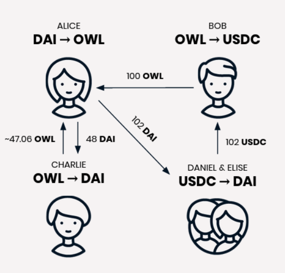

Front-end interfaces to Gnosis Protocol often provide price estimates in order to help users place informed orders. Because of the nature of Gnosis Protocol’s underlying price finding mechanism, computing these price estimates is actually a complex task, such that the estimates may appear to behave in unintuitive ways.

This post will guide you through how the price estimation service works on Gnosis Protocol, and conclude with resources for the [public API](https://price-estimate-docs.dev.gnosisdev.com/), which you can integrate into your own application.

## Ring Trades

Because of Gnosis Protocol’s ability to enable [ring trades](https://blog.gnosis.pm/announcing-the-gnosis-protocol-89b3d7794da7), prices cannot be simply computed by examining direct orders in a specific market’s order book. Consider the following orders:

In the scenario above, the question “What is the best price Alice can get for buying OWL with DAI?” is not straightforward to answer. In fact, Alice can purchase OWL either directly from Charlie OR by exchanging with Bob and then Daniel & Elise to complete her desired trade.

Within the constraints of Gnosis Protocol, in the first case, the best price Alice could get for buying OWL with DAI would be the limit price of Charlie’s order. For example, if Charlie’s order is to “buy at least 102 DAI for 100 OWL”, then the best exchange rate Alice could get is 1 OWL for 1.02 DAI.

Alternatively, in the second case, the best price Alice could get for buying OWL with DAI is the limit price of the transitive order considered over both Bob’s and Daniel & Elise’s orders. If Bob’s order is to “buy at least 101 USDC for 100 OWL” and Daniel & Elise’s order is to “buy at least 200 DAI for 200 USDC”, then the transitive order considered over Bob’s and Daniel & Elise’s orders is to “buy at least 101 DAI for 100 OWL”. It should be noted that when calculating transitive orders, all limit prices and maximum sell amounts must be respected. As it turns out, in this situation, the best exchange rate Alice could get is 1 OWL for 1.01 DAI, better than if she had traded directly with Charlie!

Therefore, Gnosis Protocol’s price estimation service does exactly this when calculating exchange rates; it computes the _most_ favorable transitive order that Alice could trade against. 

It’s important to remember that the price estimate service for Gnosis Protocol provides only _estimations_. In practice, the protocol’s price finding mechanism itself selects the best price solution based on a complex [objective function](https://docs.gnosis.io/protocol/docs/devguide03/#solution-submission). This means that just because a trade is possible doesn’t mean it will be included in a solution.

To see what we mean here, let’s consider the above example with an additional order from Fred, who also wants to buy OWL with DAI. If Fred wants less OWL for the same amount of DAI than Alice, then Fred’s order is more likely to be matched with Bob’s and Daniel & Elise’s orders on Gnosis Protocol. This is because Fred’s order provides more _utility_ and therefore better satisfies the objective function underlying how Gnosis Protocol selects order settlement solutions. However, whether an order is matched ultimately _also_ depends on the current overall order book and other opportunities to satisfy the objective function, so we can only say Fred’s order is _more likely_ to be matched.  While Gnosis Protocol’s price estimation service tries to account for this complexity, it is not always possible to predict the overall optimal price for a given trade.
Slippage
Another important aspect of calculating price estimations is slippage. 

Let’s consider the previous example with a slight twist: Alice wants to sell 150 DAI, a greater amount than before.

In this case, the transitive order considered over Bob’s and Daniel & Elise’s order does not have enough capacity to fully buy Alice’s 150 DAI order. In fact, they can only buy 101 DAI from Alice. For the remaining 49 DAI, Alice must trade with Charlie at a less favourable price. Furthermore, within the constraints of Gnosis Protocol, which guarantees uniform clearing prices, this means Alice can’t trade with Bob and Daniel & Elise at one price and with Charlie at another. So, a possible Gnosis Protocol order settlement would actually end up looking like:

In this scenario, the final exchange rate Alice would receive would be ~0.98 instead of ~0.99 because Gnosis Protocol enforces uniform clearing prices, which guarantee that Bob and Daniel & Elise receive the same prices as Charlie. As the desired trading amount increases, so could this amount of slippage on the trade.

## In practice

Now that we’ve walked you through a few scenarios that make estimating prices on Gnosis Protocol complex, here’s an overview of how we’ve approached building the price estimation service in practice.

The price estimation service:
1. Considers all of Gnosis Protocol’s currently valid orders on Gnosis Protocol, based on orders’ "valid from" and "valid to" parameters as well as other minor [smart contract constraints](https://docs.gnosis.io/protocol/docs/introduction1/#solvers);
1. Calculates all possible direct and transitive orders;
1. From these possible orders, returns the best possible price estimate for the current user.	

However, as we learned above, this is the best possible price estimate rather than an exact price. Because Gnosis Protocol replaces a centralized operator by an open, incentivized competition to which anyone can submit order settlements that solve for an objective function, the way in which this objective function may be best satisfied varies due to the utility of other possible transitive orders and environmental factors, like the current gas price on Ethereum. Of course, traders are always guaranteed to receive their limit price or better when placing an order.

To dive deeper into order settlement solutions on Gnosis Protocol, visit the Solvers section in our [introduction](https://docs.gnosis.io/protocol/docs/introduction1/#solvers).

## Integrate the price estimation API

To use the Gnosis Protocol price estimation API in your own application, please see the [current available calls and documentation available here](https://price-estimate-docs.dev.gnosisdev.com/). 

