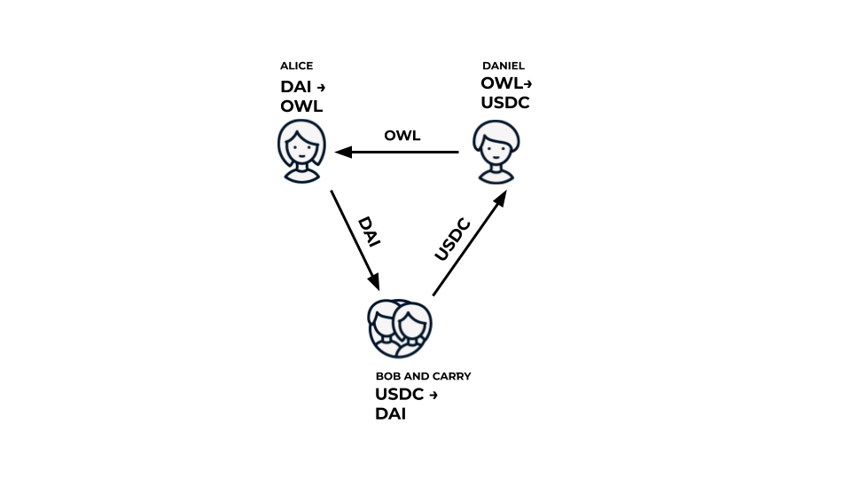

Gnosis Protocol is a fully permissionless DEX, which has been in research and development over the course of the last two years. Gnosis Protocol enables ring trades to maximize liquidity. Ring trades are order settlements which share liquidity across all orders, rather than a single token pair, and uniquely suited for trading prediction market tokens and the long tail of all tokenized assets.

Now let's step into the ring, and take a closer look at the basics.

## Trades

Gnosis Protocol is a trading protocol for ERC-20 tokens. The protocol is technically compatible with any ERC-20 token, but only tokens listed on the protocol can be traded. Token listing is permissionless and can be done by anyone. However, a spam protection fee of 10 <a href="https://blog.gnosis.pm/owl-token-use-cases-6094027ecb37">OWL</a> is required to list new tokens. You can learn more about how to list tokens in this [tutorial](https://docs.gnosis.io/protocol/docs/addtoken1/).

To trade on Gnosis Protocol, a user can simply place an order for one token in exchange for another. An order is an instruction as to what token a user wants to sell under a given price condition, thereby defining  a limit price within the order, which indicates the absolute worst price a user will receive. The protocol levies a fee of 0.1% on the volume of an executed trade. Fee costs are calculated as part of and already included in an order’s limit price.

In a perfect Gnostic world, traders would place sell orders that exactly match available buy orders, and all trades would be executed directly and seamlessly. This, however, is usually not the case. Imagine we have four parties selling one token for another token: Alice would like to exchange DAI for OWL; Bob and Cary both would like to exchange USDC for DAI; and Daniel would like to OWL for USDC. Most traditional trading protocols wouldn’t be able to directly fill these orders. In this example, Daniel might make an additional trade, exchanging their OWL for DAI to then complete the desired trade by exchanging DAI for USDC.

By enabling ring trades, however, Gnosis Protocol can fill these orders with uniform clearing prices and without requiring additional work from the trader. 

## Trading Cycles
Let’s get an owl’s eye view on how the protocol's trading cycles work to make this possible.

*  Users can place limit sell orders on-chain at any time;
*  Every 5 minutes, a **batch auction** runs;
*  At the start of an auction, all currently open orders on the protocol are considered;
*  For each auction, an open competition to submit order settlement solutions by **solvers** takes place;
*  The protocol selects the ring trade order settlement solution that maximizes trader welfare and provides single clearing prices;
*  All matched orders are settled on-chain and filled;
*  The next batch auction begins.

From a users' perspective, a full trading cycle on Gnosis Protocol consists of three user actions: deposit, order, and withdrawal. However, there's still a lot going on under the transparent hood.

### Solvers
On Gnosis Protocol, a central operator is replaced by an open competition for order matching, and the term solver refers to anyone who submits an order settlement solution for a batch auction. In principle, anyone can become a solver by submitting a proposal for order settlement, although significant technical and computational capacity is required for it to be in their economic interest.

Solvers’ proposals compete to provide the best order settlement for a given batch, with the term “best” meaning it satisfies pre-defined optimization criteria. As a simple definition, it can be said the best proposals maximize "trader welfare" as determined by volume and profit. You can learn more about this optimization criteria in a <a href="https://www.youtube.com/embed/hyF-z3Exhc4">recent talk</a> by Gnosis Engineer Felix Leupold.

Solvers can submit valid order settlements within the first 4 minutes of every batch auction, which in total run for 5 minutes each. Solvers can include any valid open orders with available deposits in a batch auction’s order settlement. Solvers do not have to match only countertrades (token A for token B with token B for token A), but can also match ring trades such as token A for token B, token B for token C, and token C for A token. However, the more orders and distinct tokens involved in a batch auction’s order settlement, the greater the calculation’s difficulty becomes.

A valid solution contains (1) a list of orders that should be executed and (2) a list of clearing prices. A single solution is only allowed to settle up to 30 orders. This is because a greater number of orders would make it significantly harder for such a transaction to be mined within the 4 minute timeframe for submitting solutions.

The solver that provides the best order settlement solution for a given batch auction is selected by the protocol, and the order settlement is then settled on-chain, resulting in all matched trades being partially executed.

After this, users can withdraw their funds from filled orders, as well as unfilled orders. 

## Benefits

*  **Fully permissionless DEX** on which anyone can list tokens and build integrations;
*  **Maximized liquidity** through **ring trades**, in which liquidity is shared among all traded assets; 
*  First implementation of **batch auctions** promoting fairer, uniform clearing prices and front-running resistance; 
*  There is a guaranteed orderbook to **trade any token pair** without having to use an intermediary token or centralized trading protocol to convert your asset;
*  **Fair, decentralized settlement** in which an open competition for order matching replaces an operator;
*  Fees are included in your limit price and paid in OWL, which can be generated from GNO, and there are **no gas costs** for executed trades. 

## Conclusion

We believe Gnosis Protocol is critical infrastructure for open finance, which will see the creation of more and more tokenized assets. For example, the number of unique prediction market conditional tokens, each representing a unique outcome in the world, could grow exponentially in size. In order to ensure marketplaces exist for the “long tail” of prediction market and all tokenized assets, it is necessary to have market mechanisms built precisely for handling large numbers of unique, and often illiquid, tokens. To this end, we built the Gnosis Protocol to become the standard for trading prediction market conditional tokens and providing access to their global liquidity pool. 

Ultimately, Gnosis Protocol is built in the spirit of permissionless innovation. Its fully decentralized architecture means you don’t need Gnosis to build on our protocol.

## FAQ

**How does the Gnosis Protocol relate to prediction markets?**  
Core to the success and utility of prediction markets, is liquidity. Without lower spread order books, permissionless prediction markets will continue to fail to capture expert knowledge on future events. 

Our existing [conditional token framework](https://docs.gnosis.io/conditionaltokens/) allows anyone to create crypto assets that represent information about future events with conditional outcomes. In essence, the conditional token framework enables the creation of prediction market assets, which could be traded on any trading protocol, not solely on a prediction market platform. However, the number of unique conditional tokens, each representing a unique outcome in the world, could grow exponentially in size. In order to ensure marketplaces exist for the “long tail” of prediction market assets, it is necessary to have market mechanisms built precisely for handling large numbers of unique, and often illiquid, tokens. To this end, we built the Gnosis Protocol to become the standard for trading prediction market conditional tokens and providing access to their global liquidity pool. 

Note: Prediction markets may constitute a regulated activity depending on the jurisdiction and depending on the market design and market topic, so that in these cases they may only be set up with the corresponding authorisation of the competent supervisory authority.

**What is Gnosis Protocol’s fee model and what role does GNO play?**  
Fees are used to incentivize an open competition in which anyone can submit an order settlement solution for every batch auction and be rewarded. Additionally, the fee model aims to bring value to all GNO token holders. In detail, on each trade, the protocol takes only a 0.1% fee on trading volume. Fees are included in a trader’s limit price and paid in their sell token. All fees are then converted into [OWL](https://blog.gnosis.pm/owl-token-use-cases-6094027ecb37), which is a token [generated](https://blog.gnosis.pm/owl-generation-2019-85be92d18552) by locking the Gnosis token, GNO. 50% of the fee is paid as an incentive to the provider of the selected order settlement solution (“solver”), while the remaining 50% of the fee is burnt. 

**How does Gnosis Protocol relate to Gnosis’ earlier DEX product, the DutchX trading protocol?**  
Both the DutchX trading protocol and Gnosis Protocol come from a similar motivation: to implement batch auctions with uniform clearing prices. Gnosis Protocol keeps all the advantages of the DutchX trading protocol but adds: shorter trading times, allowing every participant to set a limit price (i.e. on the DutchX, sellers could only place market orders), and thanks to the ring trades, Gnosis Protocol does not split liquidity into separate trading pairs.

**Will there be a version 2 of Gnosis Protocol?**  
Gnosis protocol has no admin key or other ability to upgrade, However, we will continue to innovate and suggest users to switch to a newer version if it can offer significant improvements over the previous one. A few areas of improvement could be: increased scalability and lower gas costs for usage, higher expressibility of orders, or the ability to submit sealed bids.

**Is Gnosis Protocol secure?**  
The open source code on [Github](https://github.com/gnosis/dex-contracts). The verified contracts are on Etherscan for [Mainnet](https://etherscan.io/address/0x6f400810b62df8e13fded51be75ff5393eaa841f) and [Rinkeby](https://rinkeby.etherscan.io/address/0xC576eA7bd102F7E476368a5E98FA455d1Ea34dE2). The contracts have also carefully been audited by external smart contract security experts. You can find the audit report [here](https://github.com/gnosis/dex-contracts/raw/master/Exchange_audit_report.pdf).

Since the end of January 2020, a Gnosis Protocol [bug bounty program](https://blog.gnosis.pm/2020-dex-bug-bounty-210f2b67a764) for up to $50,000 per bug report has been open.

**What is Mesa?**  
[Mesa](https://mesa.eth.link/) is the first dapp built on the Gnosis Protocol. Mesa is a general trading interface that supports simple market making strategies for stablecoins. Mesa was launched by the [dxDAO](https://twitter.com/Dxdao_), an organization leading the evolution toward a more "de"-centralized DeFi.

The dxDAO is a decentralized organization initialized in May of 2019, with over 400 unique stakeholder addresses. With a potential to grow its membership into the thousands, the community-owned and operated organization develops, governs, and promotes DeFi protocols. The dxDAO owns the DutchX trading protocol, and community members are working to launch a prediction market platform (Omen), a state of the art DEX (Mesa), a privacy-centric DeFi dashboard (Mix), and a fundraiser. 

## Additional Resources

A deeper look into Gnosis Protocol (formerly Dfusion Protocol) by Gnosis Product Manager Chris Ernst:

<figure class="video_container">
<iframe width="560" height="315" src="https://www.youtube.com/embed/hpTh_iVUOq0" frameborder="0" allow="accelerometer; autoplay; encrypted-media; gyroscope; picture-in-picture" allowfullscreen></iframe>
</figure>

  
A deeper look into fair price finding and Gnosis Protocol's optimization criteria by Gnosis Engineer Felix Leupold:

<figure class="video_container">
<iframe width="560" height="315" src="https://www.youtube.com/embed/hyF-z3Exhc4" frameborder="0" allow="accelerometer; autoplay; encrypted-media; gyroscope; picture-in-picture" allowfullscreen></iframe>
</figure>

  
For a more rigorous mathematical description of Gnosis Protocol (formerly Dfusion Protocol) please refer to the research paper: https://github.com/gnosis/dex-research/blob/master/dFusion/dfusion.v1.pdf.

