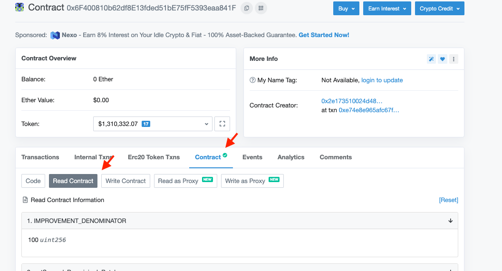
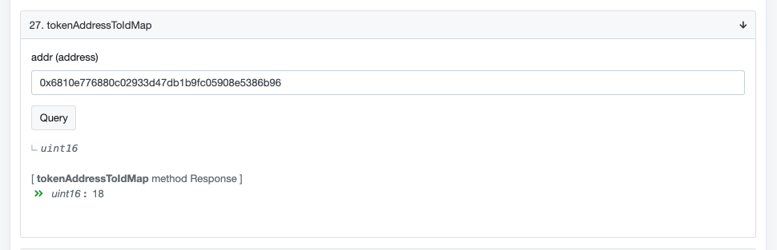
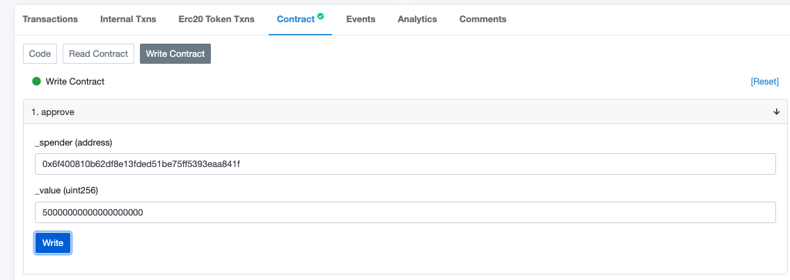
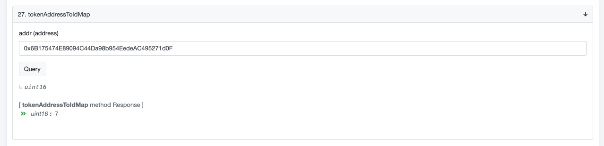
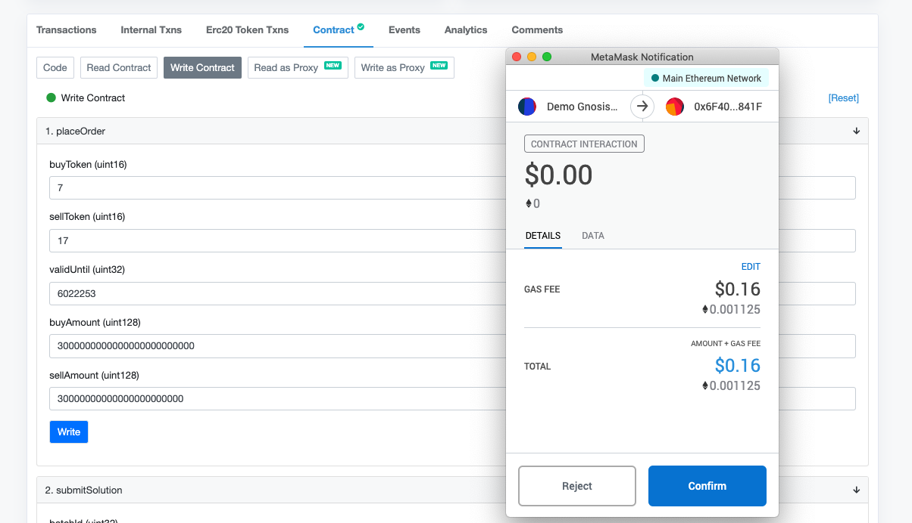

This tutorial will cover the following steps in order to place orders on Gnosis Protocol for any ERC-20 token using Etherscan:

1. Getting set up to trade:  
	a. Make sure the tokens you want to trade are listed on the protocol and hence available for trading;  
	b. Set approval for the sell token;  
	c. Deposit the sell token.
2. Place an order.
3. Withdraw funds.

If you are interested in learning about submitting multiple orders at once or pre-scheduling the orders, consider following this [tutorial](https://docs.gnosis.io/protocol/docs/tutorial-multiple-orders) afterwards.

## Getting set up to trade

Useful links:
* [Etherscan verified Mainnet Gnosis Protocol contract](https://etherscan.io/address/0x6f400810b62df8e13fded51be75ff5393eaa841f)
*  You will have to know both your sell token’s and buy token’s Ethereum addresses. Example: selling [GNO](https://etherscan.io/address/0x6810e776880c02933d47db1b9fc05908e5386b96) for [DAI](https://etherscan.io/address/0x6b175474e89094c44da98b954eedeac495271d0f). 

### Make sure the tokens you intend to trade are listed on the protocol

You can confirm this easily by going to Etherscan, and selecting tab ‘contract’, ‘read contract’:

Scroll down to Nr. 27, which is ‘tokenAddressToIdMap’ which maps each token listed on Gnosis Protocol’s address to a unique ID. 

In this example, GNO is listed as ID18, so we know that it is available for trading. 

If the token is not listed on the protocol, you receive an error message and not a number in this step.

Be sure to validate both tokens. **If one of the tokens you’d like to trade is not on the protocol, do not set up your order**. In this case, consider following this [tutorial](https://docs.gnosis.io/protocol/docs/addtoken1/) to learn how to list a token on Gnosis Protocol. Since it’s a permissionless DEX, anyone can list a token.

### Set approval for the sell token

You will have to approve the token contract of the token you would like to sell. 
Go to its token address. In this example, [GNO](https://etherscan.io/address/0x6810e776880c02933d47db1b9fc05908e5386b96):

1. Navigate to tab ‘contract’, ‘write contract’ and click on ‘connect to Web3’.

2.  Use the 1. ‘Approve’ function.  
    a. The ‘Spender’ is the Gnosis Protocol contract: 0x6f400810b62df8e13fded51be75ff5393eaa841f.  
    b. ‘Value’ is the amount you approve that the contract is allowed to spend on your behalf. (Consider that you may want to set a higher value if you foresee depositing more in the future). Important: be sure to use the correct amount of decimals. (If you are unsure, go to ‘read contract’, ‘decimals’). For example, GNO has 18 decimals. If I want to sell 50 GNO, I set the ‘value’ to 50000000000000000000.   
    c. Click ‘write’, and confirm the transaction via your web 3 provider.

		
### Deposit the sell token 

You can set up an order (explained in the following next step) even before you deposit your sell token. However, orders on Gnosis Protocol will not be matched unless there’s an available deposit. We therefore recommend completing this step first. 

Again, go to the [Gnosis Protocol Etherscan link](https://etherscan.io/address/0x6f400810b62df8e13fded51be75ff5393eaa841f). 
1. Navigate to tab ‘contract’, ‘write contract’ and click on ‘connect to Web3’.
2. Use function Nr. 4 ‘deposit’, and fill in the token’s Ethereum address and the amount you’d like to deposit. (Important: make sure you’ve entered the correct number of decimals corresponding to the token as explained in the last step).
3. Click ‘write’, and confirm the transaction via your web 3 provider.

#### Optional: verify your deposit. 
1. Head to [Gnosis Protocol Etherscan link](https://etherscan.io/address/0x6f400810b62df8e13fded51be75ff5393eaa841f). 
2. Navigate to tab ‘contract’, ‘read contract’.
3. In Nr. 21. ‘getBalance’, enter your own Ethereum wallet address and your deposited token’s address:

Deduct the relevant amount of decimals from the number returned to calculate the total amount of tokens. This example highlights a 30 GNO deposit.

### Place an order

To place a single order, go to the [Gnosis Protocol Etherscan link](https://etherscan.io/address/0x6f400810b62df8e13fded51be75ff5393eaa841f). 
1. Navigate to tab ‘contract’, ‘write contract’ and ‘click’ on ‘connect to Web3’.
2. Use the function Nr. 1 ‘placeOrder’
3. Information you need to know is displayed here: 

**buyToken** and **sellToken**: Note that this is not the token’s address. It’s the unique ID associated with each token listed on the Gnosis Protocol. (In the step 1, we already looked this up for GNO to verify that the token is indeed listed on the protocol). To make sure, we will repeat this step for DAI. Make sure to always check for both your sell and buy tokens: 

How to find the unique ID Gnosis Protocol designates to listed tokens:  
Again, go to the [Gnosis Protocol Etherscan link](https://etherscan.io/address/0x6f400810b62df8e13fded51be75ff5393eaa841f). 
1. Navigate to tab ‘contract’, ‘read contract’.
2. Use the function Nr. 4 ‘tokenIDtoAddressMap’.
3. Enter the token address.

From the number returned, we therefore know that DAI has ID7.

Before you can place your order, you must define a few remaining parameters. Placing an order using this function means the order is available to be filled from the next batch auction onwards. (If you want to pre-schedule an order or multiple orders, consider following this [tutorial on submitting multiple orders](https://docs.gnosis.io/protocol/docs/tutorial-multiple-orders).) 

You need to set a ‘validUntil’ parameter, which defines how long your order will be available for matching. This parameter is given by providing a **batch number**, which is the ID number of every consecutive batch that runs on Gnosis Protocol.

To set a meaningful number, you should know what number batch is currently running. To find this out, once again, go to the [Gnosis Protocol Etherscan link](https://etherscan.io/address/0x6f400810b62df8e13fded51be75ff5393eaa841f): 
1. Navigate to tab ‘contract’, ‘read contract’.
2. Read Nr. 25 ‘GetCurrentBatchId’.

Each batch runs for 5 minutes. Let’s assume that you want to have your order valid for approximately 2 hours, so that is 120 minutes in total. Divided by 5 (for the 5 minute batch interval), that means the duration of your order should be 24 batches. Therefore, if you add 24 to the current batchID, you get 5286437. This is the number you want to enter to set until when the order is valid. You can set any length you would like. If you would like to create a standing order that basically does not expire, you will need to set a very large number for the batchID. For example, the batchID 6100848 corresponds to an order expiring at the end of 2027, and could be considered for placing standing orders that do not expire soon. Note: if you have a particular time in mind for the order to expire, such as 12:00 UTC, rather than a duration, you can also use the Unix converter. Learn more on this in the [tutorial on submitting multiple orders](https://docs.gnosis.io/protocol/docs/tutorial-multiple-orders).

You now need to enter how much you want to sell and buy. Let’s assume you want to sell 30 GNO. You do not need to specify a price, but you do need to specify an amount you would like to receive in DAI, e.g. at least 300 would give you a price of 10 DAI per GNO. 

To enter this information, you will need to know how many decimals each token has. 
We’ve already looked up that GNO has 18 decimals earlier when we set up the approval. Let’s look up how many decimals DAI has by heading to Etherscan for the DAI token address, navigate to ‘read contract’, ‘decimals’. DAI also has 18 decimals. 

Before we input all information, please be aware that if you want to submit an order which can be filled multiple times, you want to select higher sell and buy volumes. (Note: it is possible to place this order even if the tokens are not currently deposited. However, only the deposit you have available can be successfully matched and filled.) You want to make sure that you still indicate the same price if you indicate new volumes by making sure their ratio is the same. In this example, 30000 GNO will be selected for 300000 DAI. When filling these amount parameters, be sure to add the right amount of decimal per token.

Below is what the function would now look like this standing limit order: I want to sell at most 30000 GNO for at least 300000 DAI.

Once you have confirmed with your web3 provider, you’re done. 

## Withdraw funds

There is no easy way on Etherscan to see if your trades were matched. Consider heading to the [home page](https://docs.gnosis.io/protocol) on this Gnosis Protocol Developer Portal to verify using another analytics tool. What you can do on Etherscan is check the deposits, which is explained in Step 1 of this tutorial. (For example, if my trade was matched, I will now have DAI deposited in my balance as well or instead.) You can also check the deposit to see how much you can withdraw. 

To withdraw funds, you will first have to send the withdrawal request and wait. Because the Gnosis Protocol functions in batches, the withdrawal request will be processed in the next batch. The actual withdrawal can then only happen after the withdrawal request was processed when that batch has ended.

Again, go to the [Gnosis Protocol Etherscan link](https://etherscan.io/address/0x6f400810b62df8e13fded51be75ff5393eaa841f). 
1. Navigate to tab ‘contract’, ‘write contract’ and click on ‘connect to Web3’.
2. Use function Nr. 3 ‘requestWithdraw’, and fill in the token’s address and the amount you’d like to deposit (remember to take note of the correct number of decimals as explained above).
3. Click ‘write’ and confirm the transaction via your web3 provider.

You can either wait for 10 minutes (the duration of two batches), so that you may be certain a withdrawal request was processed, or you can optionally check whether you have something called a pendingDeposit, meaning the amount available and ready for you to withdraw.

To check your pending deposit: 
1. Navigate to tab ‘contract’, ‘read contract’ and click on ‘connect to Web3’.
2. Use function Nr. 18 ‘get pending Deposit’ and fill in your wallet address and the address of the token you would like to withdraw.
From the number returned, deduct the number off decimals of that token has to learn of the actual amount.

Now, finally, you can withdraw funds:

Again, go to the [Gnosis Protocol Etherscan link](https://etherscan.io/address/0x6f400810b62df8e13fded51be75ff5393eaa841f). 
1. Navigate to tab ‘contract’, ‘write contract’ and click on ‘connect to Web3’.
2. Use function Nr. 10 ‘withdraw’ and fill in your address and the address of the token you would like to withdraw.
3. Click ‘write’ and confirm the transaction via your web3 provider.

That’s it. You’re done!

Check out this [tutorial](https://docs.gnosis.io/protocol/docs/tutorial-multiple-orders) next to learn how to set multiple limit orders in only one transaction and how to pre-schedule one or multiple orders. 

