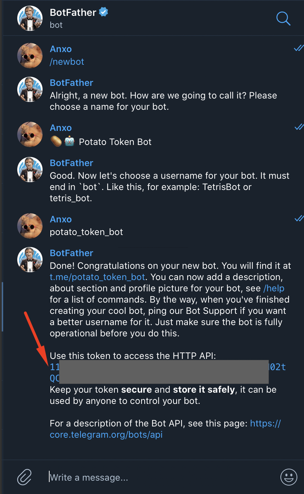

This tutorial will teach you how to set up a Telegram bot that will notify you of important activities on Gnosis Protocol.

Prerequisites:

- Telegram client: <https://desktop.telegram.org/>

- Node.js 12: <https://nodejs.org/en/>
  - Alternatively you can use Docker instead of Node.js: [https://docs.docker.com/get-docker](https://docs.docker.com/get-docker/)

### What is a Gnosis Protocol (GP) Telegram Bot?


GP Telegram bot is an open source Node.js app that listens for Ethereum events on Gnosis Protocol smart contracts, and sends notifications in a clear format to any Telegram channel.

At the time of writing (June 2020), the bot is configured to send a notification every time any user **submits a new order** on the protocol (_Note: Submitting an order is independent of a user's balance on the protocol, and the order may also be cancelled_). Using the bot, you can watch all markets, or you can specify a list of tokens for your Telegram channel to watch.

While the bot currently watches for just new order submissions, the following is a list of suggested features that could easily be added via forking the open source repository or submitting a pull request. Suggested features could include:

- Reporting trades, prices, and complete order settlements for batches;

- Allowing a user to register any Ethereum address, such that they are notified every time one of the orders associated with the registered address is executed partially or fully.

- Developing the bot into a full client for Gnosis Protocol (including prices, orders, and trade history) by using additional services such as [TheGraph](https://thegraph.com/explorer/subgraph/gnosis/protocol) and [WalletConnect](https://walletconnect.org/).

### How do you run your own GP Telegram bot?

As an overview, in this tutorial you will:

1.  🤖Create a new Telegram bot

2.  📢Create a channel where you would like the notifications to appear on Telegram

3.  👮‍♀️Make sure your bot has permission to publish in the channel

4.  🧠Setup the bot by creating a `.config` file

5.  🚀Run the bot on your server

6.  🧪Test the bot by placing an order on Gnosis Protocol

## 🤖 1\. Create a new Telegram bot

You first need to create a bot that will send the notifications to your channel.

To create a bot, Telegram provides a helper bot called The Bot Father.

The process for creating a bot is super simple:

1.  Go to <https://t.me/BotFather>

2.  Enter /help command to retrieve all the commands for the bot

3.  Enter /newbot to create a new bot and follow the steps from BotFather

4.  At the end of the process, BotFather will provide you with the authentication token that you will need for the .config setup

The entire process should look like this:



Notice the red arrow. That's your authentication token. It's required to authenticate your bot's services and notifications.

## 📢 2\. Create a channel where you would like the notifications to appear on Telegram

You will need to have a Telegram channel in which the bot sends notifications.

Create a channel using your Telegram client:\


Give the channel a name:\


Make sure the channel is public, and it has a name you like:


Save the name of the channel for later as we'll need it for the configuration. In this case, we've named our channel `@potato_token`.

Useful resource:

- ["What's a channel" FAQ](https://telegram.org/faq_channels#q-what-39s-a-channel)

## 👮‍♀️ 3\. Make sure your bot has permission to publish in the channel

Click on the channel header to enter the bot's details as an administrator:


Edit the administrators:


Add the bot as administrator:


Make sure the bot can post messages:


You should now have a new administrator in the channel:


## 🧠 4\. Setup the bot (create a config file)

First, you'll need to clone the git repository <https://github.com/gnosis/dex-telegram>.

The _README_ file in the repository contains all relevant instructions to continue from this point, and get the bot up and running.

We'll go over the steps here without too much detail.

Clone the project:

```bash
git clone https://github.com/gnosis/dex-telegram.git
```

Create a simple config file (.env) based on the [example](https://github.com/gnosis/dex-telegram/blob/develop/.env.example):

```bash
cd dex-telegram\
cp .env.example .env
```

Edit the newly created .env file using any editor.

The file has comments that will guide you through the configuration.

A small highlight of the most important ones:

- `TELEGRAM_TOKEN`: This is where you add the authentication token you created in step 1.

- `TELEGRAM_CHANNEL_ID`: This is the identifier of your channel, in this case @potato_token, from step 2.

- `NODE_URL`: This is the URL for an Ethereum node. It requires having the Websocket API enabled. You can use Infura if you don't have your own node. Just create an account at [https://infura.io](https://infura.io/), i.e. wss://mainnet.infura.io/ws/v3/<your-api-key>.

- `TOKEN_IDS_FILTER`: (Optional) This allows you to filter the notifications, such as only send notifications for orders according to a custom list of tokens. Tokens are identified in Gnosis Protocol by a unique ID intrinsic to the protocol. If you are only interested in specific token(s), like the **Potato Token**, you will need to first find out the tokenID(s) on Gnosis Protocol.

  You can do this on [Etherscan](https://etherscan.io/address/0x6f400810b62df8e13fded51be75ff5393eaa841f#readContract):

  - Navigate to tab **Contract**, **Read contract**

  - Use the function **Nr. 4** `tokenIDtoAddressMap`

  - Enter the token address of **Potato Token**

  The query will return a specific ID. (Note: the ID will be returned only if the token is indeed listed on Gnosis Protocol. If that is not the case, consider following this tutorial on [listing an ERC20 token](https://docs.gnosis.io/protocol/docs/addtoken1/).

- `WEB_BASE_URL`: When the bot sends a notification of a new order, it generates a link that allows users to fill that order. The link will take you to any defined instance of a dapp built on Gnosis Protocol (<https://github.com/gnosis/dex-react>) such as [dxDAO's Mesa dapp](http://mesa.eth.link).

  You do not have to rely on Mesa, however. Anyone can also fork this open source dapp built on Gnosis Protocol, and customize a specific graphical user interface (front-end) for Gnosis Protocol. While this is not required, let's assume you have forked the dapp and have called it 🥔 **Potato Exchange**.

## 🚀 5\. Run the bot on your server)=

### Run it with node.js

You can easily run the bot using Node.js for development:

```bash
# First install the dependencies
yarn install

# This run it for production
yarn start:env

# Optional: For development (only if you plan to add any functionality, for running it locally)
yarn dev
```

If everything runs as planned, you should see something similar to this:


### Alternatively you can run it with Docker

This actually makes it easier if you don't want to run it from your local source code, or if you don't want to install Node.js.

To do this, use the Docker image published in [@gnosispm/dex-telegram (Docker Hub)'](https://hub.docker.com/r/gnosispm/dex-telegram/tags).

You would still need to provide the configuration file, and provide the tagged version you want to use. (Note: please check the latest version and keep up eye on if new versions are published).

To run the dapp using Docker:

```bash
# Run with docker:
#   Make sure you provide your .env config and the version you want to use
docker run --env-file .env gnosispm/dex-telegram:v0.9.0
```

## 🧪 6\. Test the bot by creating an order on Gnosis Protocol

Visit any Gnosis Protocol dapp like the Potato Exchange or [Mesa](http://mesa.eth.link/), and create an order.

The channel should now receive a notification from the bot:


If it does not work or you need help, find us on [Discord](http://chat.gnosis.io).

## ✨BONUS: About command

The bot, like any piece of software relying on network access, can have connectivity issues.

One nice thing about the bot, is that we can can try to talk to it, and see if it replies:


Also, it has a convenient `/about` command that would give you a lot of useful information, such us the running version of the bot, the contract that it is watching, the network it's listening to, and the last mined Ethereum block that it is aware of:


The last mined block can be useful if we suspect that for some reason the bot is disconnected from the node. This way, we can check if this block is recent or not, for example by comparing it with the last mined block we see on [etherscan.io](https://etherscan.io/).

## Wrapping up

In this tutorial, you've learned how to create your own Telgram channel, and run a bot that posts important trading information from Gnosis Protocol.

This bot, and the available dapp Mesa, are open source. This means they can be forked and adjusted to your individual needs. If you fork the project, we would appreciate it if you contribute any added functionality back to the repository in the form of PRs. Your contribution and comments make Gnosis Protocol stronger! Always let us know what you think, and join us on the Gnosis [Discord](http://chat.gnosis.io) chat.
