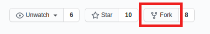
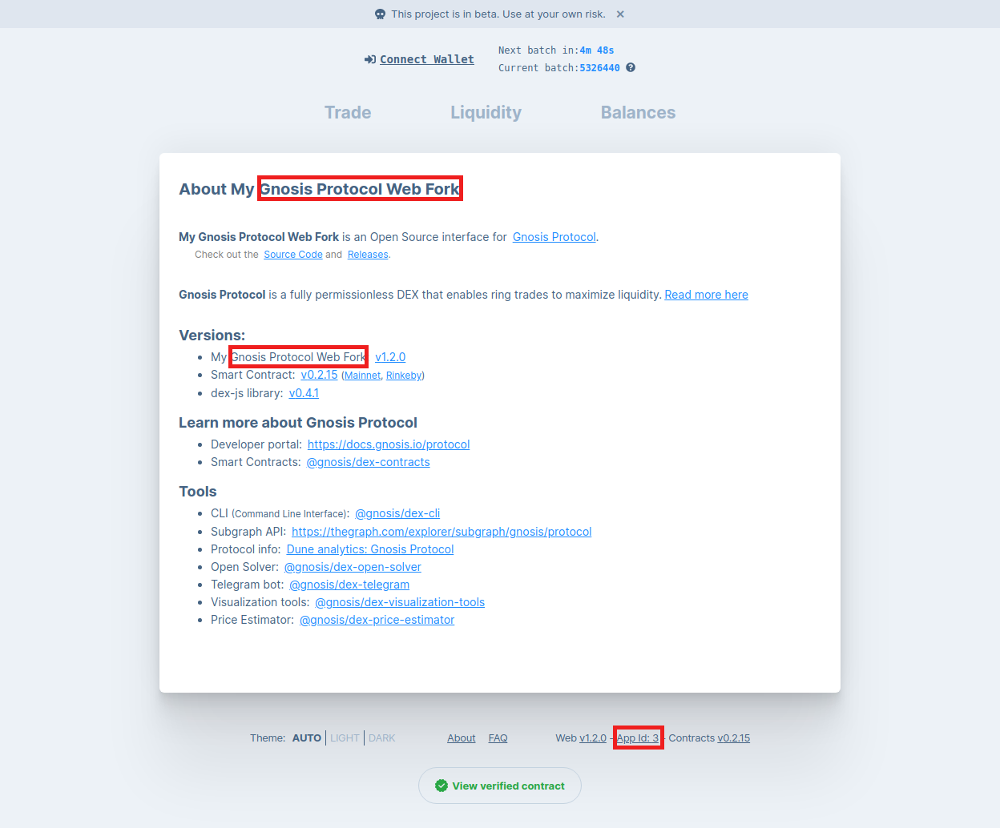
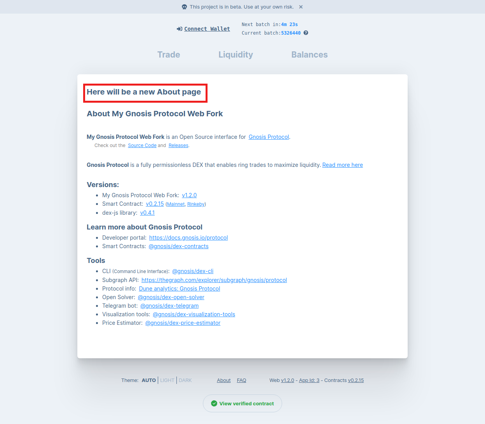

This tutorial will walk you through how to create your own fork of a Gnosis Protocol web interface.

In summary, this tutorial covers:


1. Forking the [dex-react](https://github.com/gnosis/dex-react) repository
2. Setting up a custom configuration in `custom/config.yaml`
3. Making changes to the codebase directly or inside the custom directory
4. Deploying your modified application

Let us go through these steps one by one.


## Forking the dex-react repository


1. To fork the repository at [https://github.com/gnosis/dex-react](https://github.com/gnosis/dex-react), you will first need to be logged into your GitHub account.
2. Then, you will click on the **Fork** button in the upper right corner.



3. You will be redirected to your fork of **dex-react** repository at address `https://github.com/<username>/dex-react`, where `<username>` is your account username.
4. If you have [git](https://git-scm.com/) or another version control system installed, clone the repository with:

    ```git clone https://github.com/<username>/dex-react.git```

5. Now that you have your own copy of **dex-react **locally, navigate to its local directory and install its dependencies by running:
    ```
    yarn # recommended
    # or
    npm install
    ```
6. Check that the application works by running it with:

    ```
    yarn start
    ```
After the start process, it will be accessible at [http://localhost:8080](http://localhost:8080).

More information on forking **dex-react** repository can be found on [wiki/Fork-project](https://github.com/gnosis/dex-react/wiki/Fork-project).


## Setting up a custom configuration in `custom/config.yaml`

The project’s most important configuration parameters, such as the application **name**, **appId**, and token list, can be specified in a custom configuration file located in the project directory at `custom/config.yaml`. 

At a minimum, an **appId** must be specified, and this appId parameter *must* be different from the currently taken Ids. To choose an available **appId,** see [wiki/App-Ids-for-Forks](https://github.com/gnosis/dex-react/wiki/App-Ids-for-Forks).

``custom/config.yaml`` must follow the structure of default configuration file `config-default.yaml`, and can specify all the same fields. At build time, the two configs are merged with fields in custom config overriding those in the default config. While it is recommended to use YAML format for the custom config file, JSON format is also supported (custom/config.json).

A common change one may want to implement is to set a custom [TCR](https://github.com/gnosis/dex-react/wiki/Config#tcr) for the app to connect to a custom TCR contract to keep a curated list of tokens visible on the interface.

More information on setting up a custom config can be found on [wiki/Config](https://github.com/gnosis/dex-react/wiki/Config).

Now, let’s try changing the project name and **appId** through a custom config file. Create a `custom/config.yaml` file containing:

```
# App Id
#    Get yours at: https://github.com/gnosis/dex-react/wiki/App-Ids-for-Forks
appId: <your-app-id>

# Name of the app
name: My Gnosis Protocol Web Fork
```


Then, restart the application with `yarn start`, and open your browser at [http://localhost:8080/about](http://localhost:8080/about).

You should see the changes already in effect.




## Making changes to the codebase directly or inside the `custom` directory

The project implements an _alternative source directory_ to allow for easier override without changing the already present code. You should make changes mainly in this directory in order to easily incorporate any desired updates from the original project repository.

All absolute import paths will try to be resolved first from `custom/<path>`, failing that from `src/<path>`, and finally from `node_modules/<path>`.

Let’s illustrate this with an example. Given two files:

*   `src/pages/About.tsx`
*   `custom/pages/About.tsx`

```
import About from 'pages/About'
// will try resolving from custom/ first and failing that from src/
```

This allows for easier plug-n-play customization and simplifies future merges from upstream. Let’s try making a custom about page:

1. Copy `src/pages/About.tsx` to `custom/pages/About.tsx`
```
mkdir -p custom/pages
cp src/pages/About.tsx custom/pages/About.tsx
```
2. Now, edit the newly created `custom/pages/About.tsx` like so:

```
   <AboutWrapper>
   + <h1>Here will be a new About page</h1>
     <h1>About {CONFIG.name}</h1>
```

3. As before, restart the application with `yarn start` and open your browser at [http://localhost:8080/about](http://localhost:8080/about). You should see the text you just added visible on the interface:





Keep in mind that the _alternative source directory_ only works for absolute paths. If you want to change something in a file that is imported as `./&lt;path>/&lt;file>`, you will have to change it in place.

For more details on customizing components, please refer to [wiki/Customize-Components](https://github.com/gnosis/dex-react/wiki/Customize-Components).


## Deploying your modified application

Now that you have modified your application and want to commit the changes, make sure you delete the `custom/.gitignore` file. It is there to keep the custom directory committed when it’s empty.

Afterwards, you can build the application with `yarn build` and upload the resulting build directory to a hosting setup of your choice.

To further develop your fork of a Gnosis Protocol web interface, we encourage you to explore incorporating additional services:

*   Deploying a [Telegram Bot](https://docs.gnosis.io/protocol/docs/tutorial-telegram-bot/)
*   Setting up a [Custom Market Maker](https://docs.gnosis.io/protocol/docs/tutorial-cmm/)
*   [Listing a Token on Gnosis Protocol](https://docs.gnosis.io/protocol/docs/addtoken1/)

We would also be happy to receive PRs for any features you add to your fork that you want to see available upstream.
