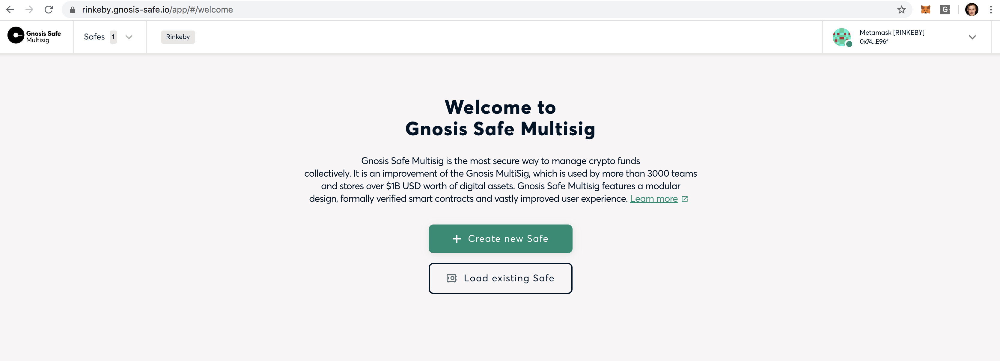
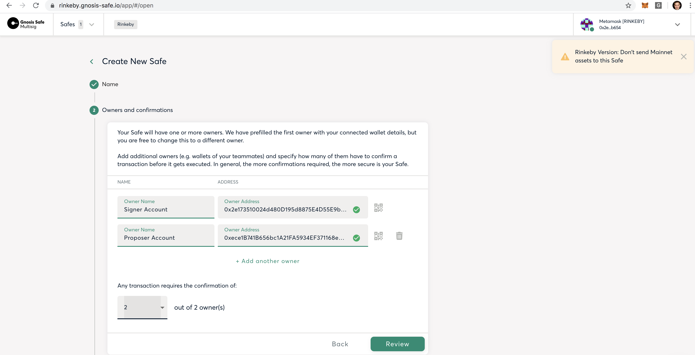
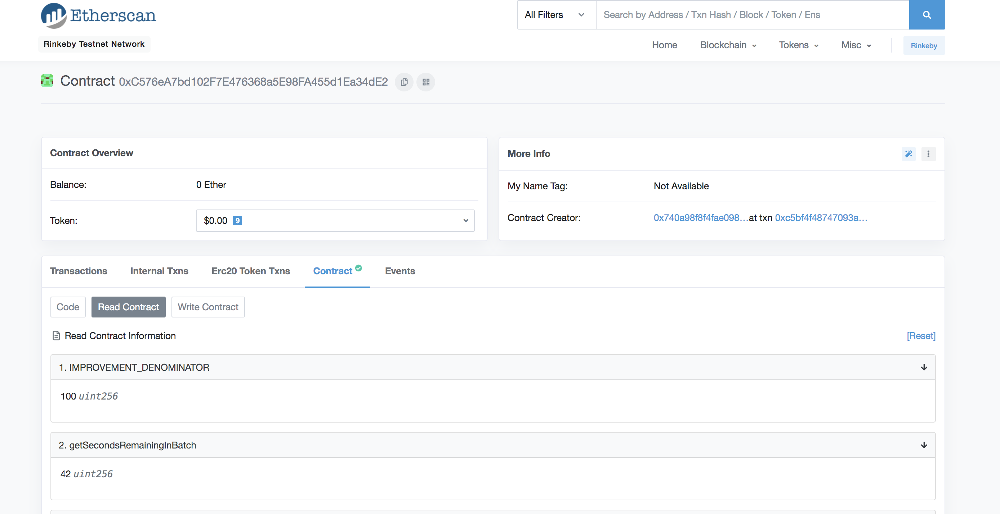
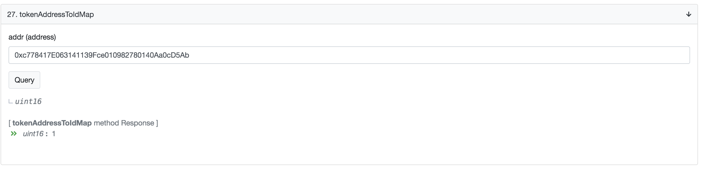
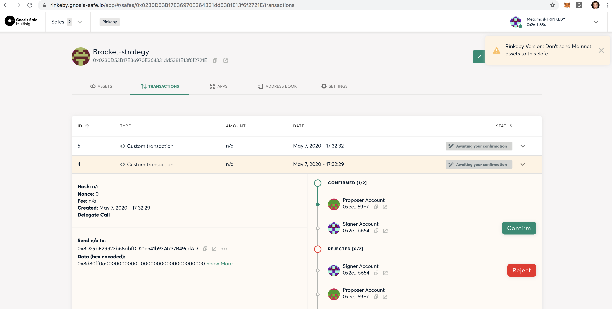

# Tutorial: Liquidity Provision on Gnosis Protocol

Before getting started, make sure you have familiarized yourself with the Gnosis Protocol [introduction](https://docs.gnosis.io/protocol/docs/introduction1).

This tutorial explains how to provide liquidity passively via standing orders with a so-called "bracket-liquidity strategy". This strategy deploys several "brackets" (Gnosis-Safe contracts), which hold and trade two tokens `(token_1, token_2)` against each other on the Gnosis Protocol.
They are called brackets, as their orders are opening and closing like brackets:
One order is selling `token_1` for `token_2` for a certain price, while the second order is buying `token_1` for `token_2` at a little bit lower rate.
If the price moves in way such that both orders are traded one after the other, the passive liquidity provider earns the spread of their orders.

This concept is well explained in the documentation of [programmable orders](https://docs.google.com/document/d/1_zTkuhWioTbRsbwKnBi5gEi3m7-bFcPyikQid7EUA2M/edit). Please study this article carefully before proceeding with this tutorial.

This tutorial will cover the following steps:

1. Prerequisites
2. Setting up a MASTER_SAFE
3. Liquidity provision
4. Withdrawing liquidity
5. Securing your setup with more owners

If you have any questions, don't hesitate to visit us in the [Gnosis discord channel](https://chat.gnosis.io/)

## Prerequisites

In this tutorial uses mainly two tools: The normal truffle scripts to build complicated and bundled ethereum transactions and the Gnosis-Safe interface to sign most of these transactions. In the Gnosis-Safe interface, we will generate a MASTER_SAFE, which will own all other accounts required for the liquidity provision and has full control over the funds involved in the liquidity provision.

The prerequisites to this tutorial are:

1.  Have a _proposer-account_: You should generate a new Ethereum-account via your preferred tool (e.g., MetaMask) and fund this account with a little bit of Ether. 0.2 ETH should suffice.
    This account will be used for two tasks: Firstly, it will be used to deploy new proxy-contracts. Secondly, it is used to propose transaction to the Gnosis-Safe interface.

2.  Have a _signer-account_: You should have one designated signer Ethereum-account. This account can be an already given account, and most people would probably prefer to use their usual MetaMask account. This signer-account will be added as an owner to your MASTER_SAFE and you will sign transactions with it.

3.  Investment-tokens: Have the tokens you want to invest in the liquidity provision ready.

4.  Token-listing: Once you have decided for a token pair to provide liquidity for, you need to make sure that both tokens are already listed on the exchange. Listing is a permissionless process and is explained [here](https://docs.gnosis.io/protocol/docs/addtoken1/).

## Setting up a MASTER_SAFE

In the upcoming sections, all scripts are executed on Rinkeby only.
In order to perform the steps on Mainnet, you need to do some obvious modifications. For example, you would want to go to [https://gnosis-safe.io/](https://gnosis-safe.io/) instead of [https://rinkeby.gnosis-safe.io/](https://rinkeby.gnosis-safe.io/).

First, we will generate a Gnosis-Safe account. This account is needed to bundle a lot of Ethereum transactions to 2 only transactions to simplify the whole setup process and to safe gas.

1. Visit: https://rinkeby.gnosis-safe.io/ and sign into MetaMask with your "signer account".



2. Create a new Gnosis-Safe by following the steps on the display:

- give your Gnosis-Safe a name: `MASTER_SAFE`
- add a second owner, the "proposer account"
- set the threshold for executing transactions to 2
  

3. Finish the setup process by signing the MetaMask transaction

4. Now, you should see your brand new gnosis-safe. Congrats. Send the funds you want to invest into the bracket strategy to the Gnosis-Safe.

## Liquidity provision

Get the code of github repo: https://github.com/gnosis/dex-liquidity-provision by running:

```ssh
cd <your preferred dictionary>
git clone git@github.com:gnosis/dex-liquidity-provision.git
cd dex-liquidity-provision
yarn install
npx truffle compile
yarn run networks-inject
```

`yarn install` will install all dependencies needed and `npx truffle compile` will compile your the necessary contracts.
`yarn run networks-inject` will make sure that you will work with the correct contracts - it will inject the network addresses into your truffle builds.

You find the core script placing orders for the basic liquidity strategy in the folder `scripts/complete_liquidity_provision.js`.

Before you start this script, you need to export some environment variables and prepare the parameters.

### Env variables

Run the following commands in your console:

```ssh
export NETWORK_NAME=rinkeby
export GAS_PRICE_GWEI=<gas price>
export MASTER_SAFE=<your safe address>
export PK=<your private key of the proposer-account>
```

The `NETWORK_NAME` should be set to Mainnet or Rinkeby. The gas price should be set in a way that your transaction gets mined in a reasonable time. Check out reasonable gas prices on [ethgasstation](https://ethgasstation.info/).
The `MASTER_SAFE` should be the safe address from the Gnosis-Safe created in the previous section.
The `PK` should be the private key of your proposer account used as an owner in the Gnosis-Safe.
Note, that in our current setup the PK is not secured with the highest standards.
Hence, do not deposit more funds than some deployment ETH into this account.

### Script parameters

The script `complete_liquidity_provision` takes the following non-optional parameters:

- _masterSafe_: This is the MASTER-SAFE you generated in the previous step. You should set the value to \$MASTER_SAFE
- _fleetSize_: The fleet size determines how many brackets you want to deploy. This number must be even and smaller than 20.
- _targetToken_: You are specifying two tokens you want to provide liquidity for, the _targetToken_ and the _stableToken_ via their indices. In order to get the `tokenIndex` of a token, follow the next section. If you specify the more stable token via stableToken and the more volatile token via targetToken, then most likely the price parameter is more intuitive. Eg., if you are trading `ETH/DAI` with `stableToken=Index(DAI)`, then the parameter `currentPrice` can be specified as a number > 1.
- _stableToken_: specifies the second token you want to trade via its `tokenIndex`. In order to determine the tokenIndex, see the section.
- _investmentTargetToken_: This is the cumulative sum of all targetTokens you want to invest in all brackets
- investmentStableToken: This is the cumulative sum of all stableTokens you want to invest in all brackets
- _currentPrice_: Please provide the current price of the trading pair: [ targetToken ] / [ stableToken ]. Your input will be checked for plausibility by the script via the price of dex.ag
- _lowestLimit_: The liquidity provided will be split over the a price range of [lowestLimit, highestLimit]. Hence, the lowestLimit specifies the lowest price any bracket should trade.
- _highestLimit_: The liquidity provided will be split over the a price range of [lowestLimit, highestLimit]. Hence, the highestLimit specifies the highest price any bracket should trade.

#### Getting the `tokenIndex` of your tokens

All token that have been added to the Gnosis protocol get a unique `tokenIndex`. In order to read the `tokenIndex`, visit [Etherscan GP contract(Rinkeby)](https://rinkeby.etherscan.io/address/0xc576ea7bd102f7e476368a5e98fa455d1ea34de2#code) or for mainnet [Etherscan GP contract(Mainnet)](https://etherscan.io/address/0x6f400810b62df8e13fded51be75ff5393eaa841f). Then, click on the tab: _Contract_ and the button "Read Contract":



Then, you want to go down to the function: `tokenAddressToIdMap` and paste the token address of your token into the parameter field and run the query.
In the following image, we used the WETH address in Rinkeby, which happens to have the index 1.



If your tokens have not been added to the Gnosis-protocol, please follow this [tutorial](https://docs.gnosis.io/protocol/docs/addtoken1/).

### Running the script and place your first liquidity strategy

The following script will place programmable orders for the pair DAI-WETH on a price range [150,260] on Rinkeby.
You will invest 1000 [DAI](https://rinkeby.etherscan.io/address/0x5592EC0cfb4dbc12D3aB100b257153436a1f0FEa) and 5 [WETH](https://rinkeby.etherscan.io/address/0xc778417E063141139Fce010982780140Aa0cD5Ab).

```ssh
export NETWORK_NAME=rinkeby
export GAS_PRICE_GWEI=1
export MASTER_SAFE=<your master safe>
export PK=<your private key of the proposer account>
```

```ssh
cd dex-liquidity-provision
yarn install
npx truffle compile
yarn run networks-inject
npx truffle exec scripts/complete_liquidity_provision.js --targetToken=0 --stableToken=7 --lowestLimit=150 --highestLimit=260 --currentPrice=200 --masterSafe=$MASTER_SAFE --investmentTargetToken=5 --investmentStableToken=1000 --fleetSize=20 --network=$NETWORK_NAME
```

The script will first make some plausibility checks as the mentioned price check and that the boundaries - highestLimit and lowerLimit - are set reasonable for the current price.

Then, it will create a transaction deploying new safes. All the address of the Gnosis-Safes will be printed on the screen.

Afterwards, the transaction containing all the orders will be build.
All the order placements will be bundled into one transaction, which will appear first in the Gnosis-Interface.
Before you sign the transaction, make sure to check the correctness of the displayed orders of the script output.

Also, the transaction sending the DAI and WETH into the brackets and depositing it on behalf of the brackets into the GP exchange contract is built in parallel.
This is the second transaction send to the interface.

If everything goes smoothly, you should see the two transaction initiations confirmed like that:

```ssh

==> Sending the order placing transaction to gnosis-safe interface.
    Attention: This transaction MUST be executed first!

Signing and posting multi-send transaction 0x007ecc58f9dc222c26215b260abc363e0308dfec539d7eeabb8a2c9f09397157 from proposer account 0x740a98F8f4fAe0986FB3264Fe4aaCf94ac1EE96f
Transaction awaiting execution in the interface https://rinkeby.gnosis-safe.io/app/#/safes/$MASTER_SAFE/transactions

==> Sending the funds transferring transaction, please execute this transaction second

Signing and posting multi-send transaction 0x09cb78a5a49f10305a2f108d45e8fa059e4231ebf219315c56409d67419d65fb from proposer account 0x740a98F8f4fAe0986FB3264Fe4aaCf94ac1EE96f
Transaction awaiting execution in the interface https://rinkeby.gnosis-safe.io/app/#/safes/$MASTER_SAFE/transactions
```

Now, you should just follow the link and sign & execute the transaction with the lower transaction-ID first. It should look like this:



For executing, just press the button _confirm_.

If you are executing the second transaction with a lower gasPrice than the first one, then you can sign it immediately.
Otherwise, you should wait until the first one is mined. This works as the gas price usually determines the mining order of the transaction.

Congrats. You managed to provide liquidity and have a chance to earn a passive income, if the prices are moving and returning back to your initial currentPrice.

## Withdrawing liquidity

The withdrawal from the Gnosis Protocol is always done in two step: requesting withdrawals and the actual withdrawal transferring the funds.

### Withdraw request

Withdrawal requests can be made with the following command:

```ssh
npx truffle exec scripts/withdraw.js --masterSafe=$MASTER_SAFE --brackets=[comma separated brackets]  --tokenIds=[indices] --requestWithdraw --network=$MASTER_SAFE
```

Here, the flag `--requestWithdraw` is very important part, which tells the script to initiate the the withdraw request.
The `tokenIndices` of the tokens, which you want to withdraw from the brackets need to be specified via the flag `--tokenIds=[indices]`.
Under normal usage, these are the exact same indices, which were used during the liquidity provision.
The flag `--brackets=[comma separated brackets]` needs to contain the brackets that were deployed during the liquidity provision.
In case you don't remember them, you would have to run the following command:

```ssh
npx truffle exec scripts/get_deployed_brackets.js --masterSafe=$MASTER_SAFE --network=$NETWORK_NAME
```

which will display all your previously written brackets and generate a CSV listing the brackets with more information.

By running the withdraw request script, you have generated a transaction within your Gnosis-safe interface. Execute this transaction and wait - maximal 5 minutes after the transaction gets mined - until the Gnosis Protocol closes the current auction batch.
In the next batch you will be able to withdraw your funds.

### Withdrawing funds

The actual withdraw transaction transferring the tokens back into the MASTER_SAFE from the Gnosis Protocol can be initiated with the following command.

```ssh
npx truffle exec scripts/withdraw.js --masterSafe=$MASTER_SAFE --brackets=[comma separated brackets]  --tokenIds=[indices] --withdraw --network=$MASTER_SAFE
```

The parameters are basically the same as in the requesting withdraw script, besides the new flag `--withdraw` instead of `--withdrawRequest`.

## Even more secure setup with more owners

(still todo)

## Useful links

- [Etherscan verified Mainnet OWL token contract](https://etherscan.io/token/0x1a5f9352af8af974bfc03399e3767df6370d82e4)
